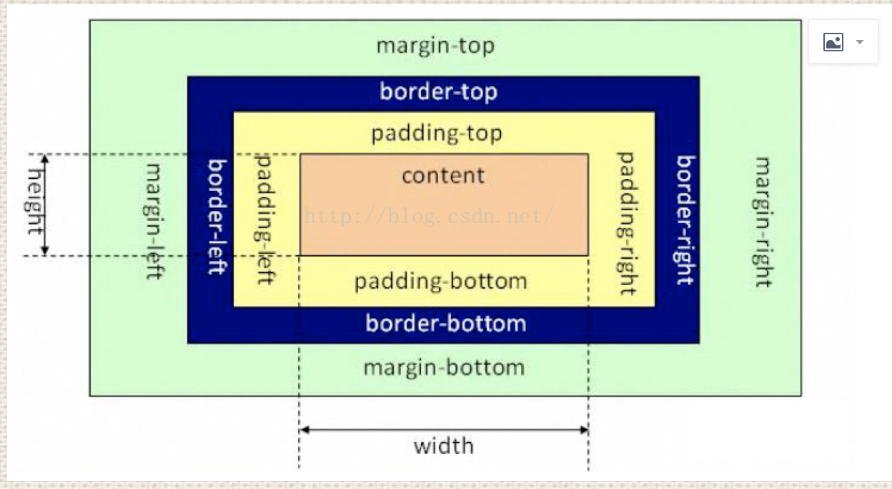
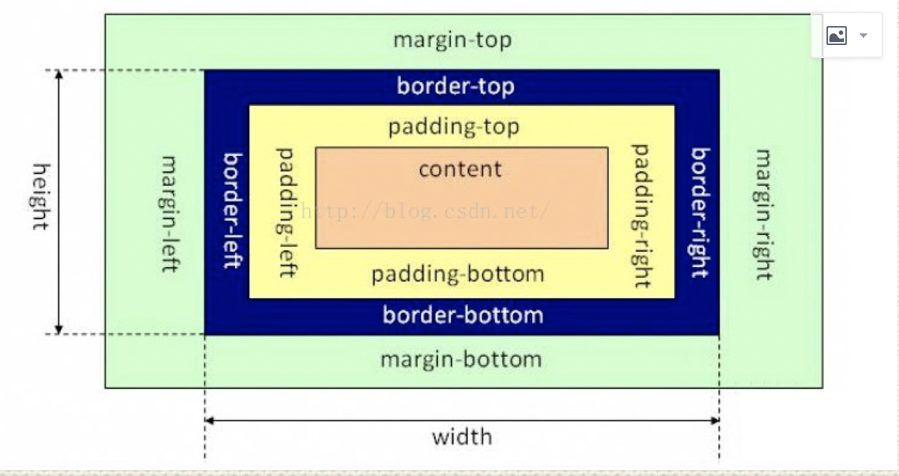

# 盒模型

## 定义

**定义了一种长方形的盒子——包括它们各自的内边距（padding）与外边距（margin ）**

### 盒子的四个区域

1. 内容区域(content)：文字，图片，视频的存放区域

2. 内边距区域(padding)：盒子边框与内容区域之间的间隔区域。(上,右,下,左), (上下,左右),(上, 左右, 下)

3. 边框区域(border)：边框的区域。(上,右,下,左), (上下,左右),(上, 左右, 下)

4. 外边距区域(magin)：盒子与盒子的间隔距离。(上,右,下,左), (上下,左右),(上, 左右, 下)

## 运用

### 标准盒模型

> 盒子的宽度=左右border+左右padding+width

### IE盒模型

> 盒子的宽度=width

## 应用场景
### box-sizing的值
1. content-box， 对应标准盒模型
2. border-box，对应ie盒模型
3. inherit，从父元素继承 box-sizing 属性的值
