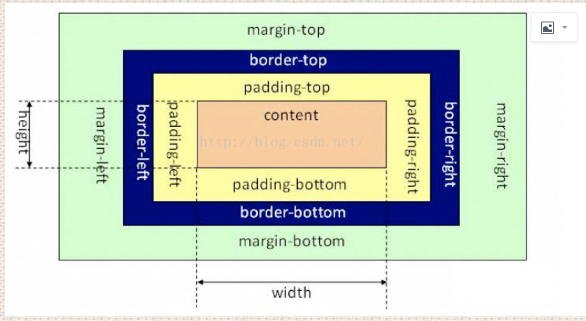
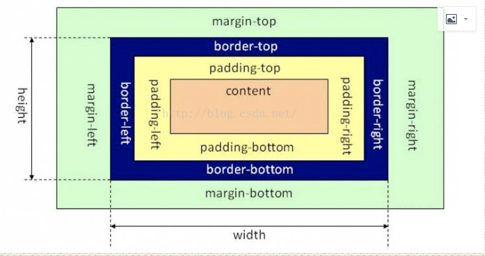

# 盒模型

## 定义

**定义了一种长方形的盒子——包括它们各自的内边距（padding）与外边距（margin ）**

### 盒子的四个区域

#### 内容区域(content)：文字，图片，视频的存放区域
- 可设置的值：width, max-width, min-width
- 可设置的值：height, max-height, min-height

####  内边距区域(padding)：盒子边框与内容区域之间的间隔区域

- 可设置的值：padding-top, padding-right, padding-bottom, padding-left
- 设置4个值：(上, 右, 下, 左)
- 设置3个值： (上, 左右, 下)
- 设置2个值： (上下, 左右)

####  边框区域(border)：边框的区域
- 可设置的值：border, border-color, border-radius, border-image, border-shadow, border-style
- CSS3新增的用来设置边框的样式: outline, outline-color, outline-style, out-line-width

####  外边距区域(magin)：盒子与盒子的间隔距离

- 可设置的值：margin-top, margin-right, margin-bottom, margin-left
- 设置4个值：(上, 右, 下, 左)
- 设置3个值： (上, 左右, 下)
- 设置2个值： (上下, 左右)

## 运用

### 标准盒模型

> 盒子的宽度=左右border+左右padding+width

### IE盒模型

> 盒子的宽度=width

## 应用场景

### box-sizing的值

1. content-box， 对应标准盒模型
2. border-box，对应ie盒模型
3. inherit，从父元素继承 box-sizing 属性的值
