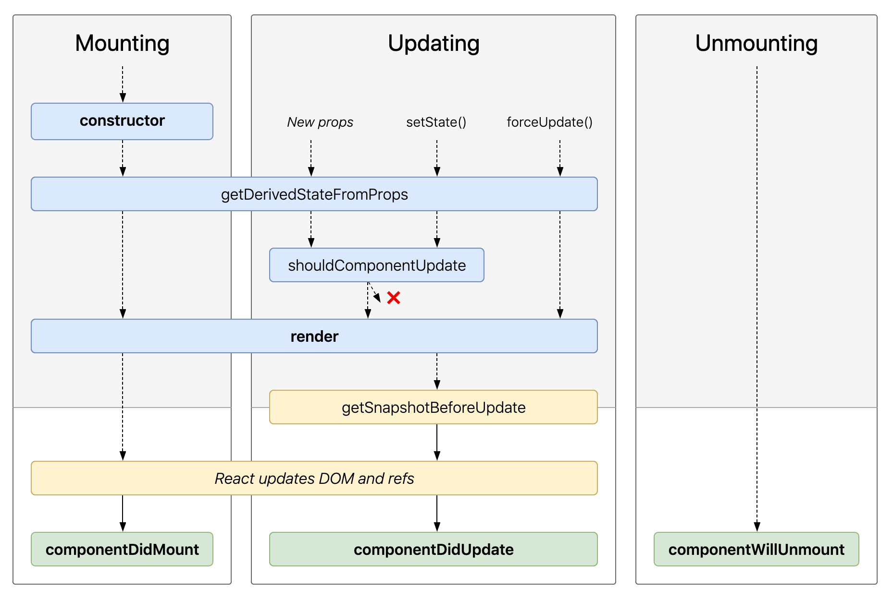

# state和生命周期

## state
1. 不要直接修改 state; 因为直接对state进行赋值和修改操作不会重新新渲染组件
2. 使用 setState({属性名:属性值})修改state
3. state的更新可能是异步的, 当异步操作使用回调函数操作其它属性： `setState({属性1:属性1的值},()=>{setState({属性2:属性2的值})})`
4. state的更新会被合并
5. 组件可以选择把它的 state 作为 props 向下传递到它的子组件中

## 生命周期

### 将函数组件转换成 class 组件
1. 创建一个同名的 ES6 class，并且继承于 React.Component。
2. 添加一个空的 render() 方法。
3. 将函数体移动到 render() 方法之中。
4. 在 render() 方法中使用 this.props 替换 props。
5. 删除剩余的空函数声明。

### 实现一个计时器的组件
```jsx
class Clock extends React.Component {
  constructor(props) {
    super(props);
    this.state = {date: new Date()};
  }

  componentDidMount() {
    this.timerID = setInterval(
      () => this.tick(),
      1000
    );
  }

  componentWillUnmount() {
    clearInterval(this.timerID);
  }

  tick() {
    this.setState({
      date: new Date()
    });
  }

  render() {
    return (
      <div>
        <h1>Hello, world!</h1>
        <h2>It is {this.state.date.toLocaleTimeString()}.</h2>
      </div>
    );
  }
}

ReactDOM.render(
  <Clock />,
  document.getElementById('root')
);
```
#### 调用顺序
1. 当 `<Clock />` 被传给 ReactDOM.render()的时候，React 会调用 Clock 组件的构造函数。因为 Clock 需要显示当前的时间，所以它会用一个包含当前时间的对象来初始化 this.state。我们会在之后更新 state。
2. 之后 React 会调用组件的 render() 方法。这就是 React 确定该在页面上展示什么的方式。然后 React 更新 DOM 来匹配 Clock 渲染的输出。
3. 当 Clock 的输出被插入到 DOM 中后，React 就会调用 ComponentDidMount() 生命周期方法。在这个方法中，Clock 组件向浏览器请求设置一个计时器来每秒调用一次组件的 tick() 方法。
4. 浏览器每秒都会调用一次 tick() 方法。 在这方法之中，Clock 组件会通过调用 setState() 来计划进行一次 UI 更新。得益于 setState() 的调用，React 能够知道 state 已经改变了，然后会重新调用 render() 方法来确定页面上该显示什么。这一次，render() 方法中的 this.state.date 就不一样了，如此以来就会渲染输出更新过的时间。React 也会相应的更新 DOM。
5. 一旦 Clock 组件从 DOM 中被移除，React 就会调用 componentWillUnmount() 生命周期方法，这样计时器就停止了。


### 生命周期阶段



主要分成3类阶段
1. 挂载阶段；
2. 更新阶段；
3. 卸载阶段

#### 挂载
当组件实例被创建并插入 DOM 中时，其生命周期调用顺序如下：
1. constructor()
2. static getDerivedStateFromProps()
3. render()
4. componentDidMount()

#### 更新阶段
当组件的 props 或 state 发生变化时会触发更新。组件更新的生命周期调用顺序如下
1. static getDerivedStateFromProps()
2. shouldComponentUpdate()
3. render()
4. getSnapshotBeforeUpdate()
5. componentDidUpdate()

### 卸载
当组件从 DOM 中移除时会调用如下方法：
1. componentWillUnmount()
