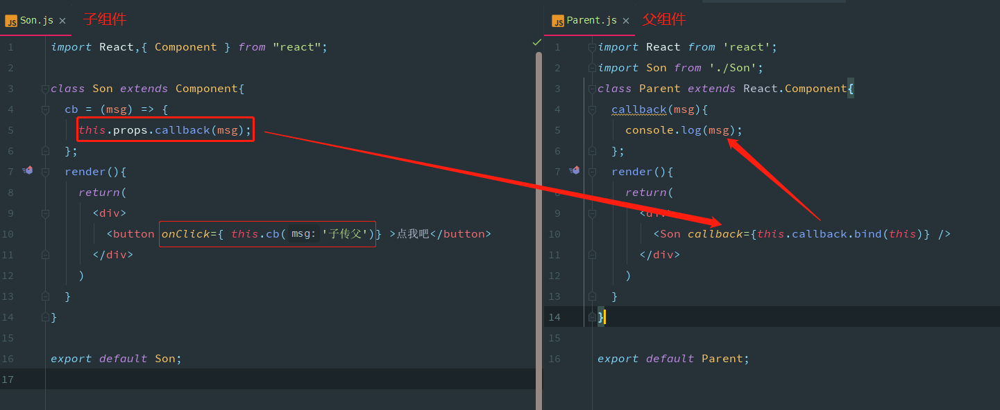

# 组件通信方式

https://www.jianshu.com/p/e2c5e6f60404
https://blog.csdn.net/zhengjie0722/article/details/81979919
https://www.jianshu.com/p/fb915d9c99c4

## 父组件->子组件
1. 父组件通过向子组件传递 props，子组件得到 props 后进行相应的处理

## 子组件->父组件
1. 使用回调函数

2. 使用自定义事件

## 兄弟组件间通信

## 跨级组件通信
1. 中间组件层层传递 props
如果父组件结构较深，那么中间的每一层组件都要去传递 props，增加了复杂度，并且这些 props 并不是这些中间组件自己所需要的。当组件层次在三层以内可以采用这种方式，当组件嵌套过深时，就考虑其他方式

2. 使用 context 对象
context 相当于一个全局变量，是一个大容器，我们可以把要通信的内容放在这个容器中，这样一来，不管嵌套有多深，都可以随意取用
- 上级组件要声明自己支持context，提供context中属性的PropTypes，并提供一个函数来返回相应的context对象
- 子组件要声明自己需要使用context，并提供其需要使用的context属性的PropTypes
- 父组件需提供一个getChildContext函数，以返回一个初始的context对象
> 如果组件中使用构造函数（constructor），还需要在构造函数中传入第二个参数 context，并在 super 调用父类构造函数是传入 context，否则会造成组件中无法使用 context。

