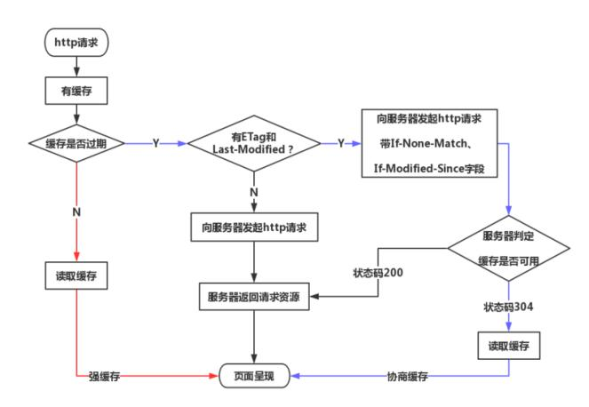
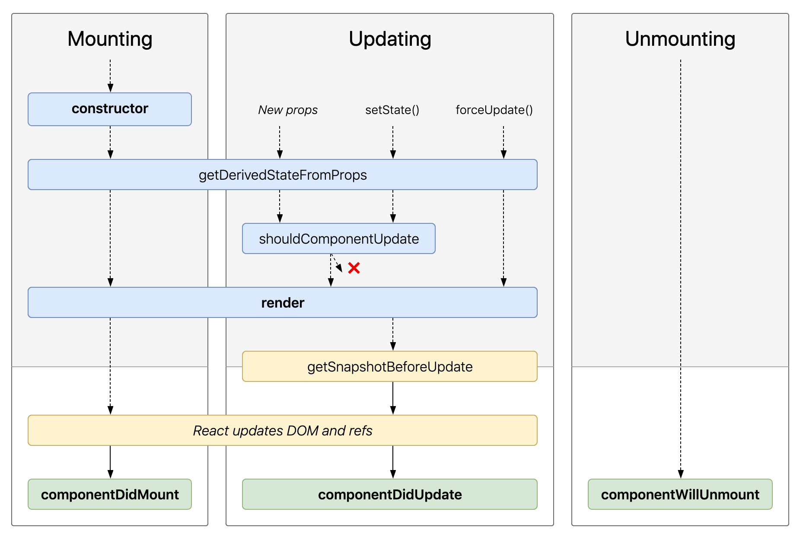
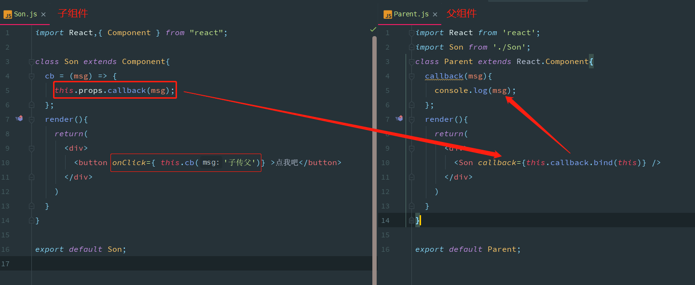

# 网络
## http和https的区别
|区别点|http|https|备注
|:----------|:----------|:----------|:----------
|传输方式|明文传输|加密传输|http是超文本传输协议，https使用具有安全性的ssl加密
|端口号|80|443|默认端口
|连接方式|无状态的连接|ssl（Secure Sockets Layer 安全套接字协议）+http的协议|https更安全一些
|费用|免费|高昂费用|https协议需要到ca申请证书，一般免费证书较少，因而需要一定费用

## http1.1和http2.0的区别
|区别|http1.1|http2.0|备注
|:----------|:----------|:----------|:----------
|二进制分帧|文本格式|采用二进制格式|http2.0在应用层和传输层中加了一个“二进制分帧层”，可以将信息分割为更小的消息和帧，并对它们采用二进制格式进行编码
|多路复用|持久连接，但是有连接数的限制|完全的多路复用，一旦建立连接就可以多次发送|connection: close;connection:keep alive
|头部压缩|头部携带大量的信息，每次都要重复发送|采用头部压缩算法降低开销|头部压缩算法,在通信双方各自保存一份头部字典
|服务端推送||服务端和浏览器一旦建立连接，服务端可以主动的向浏览器推送资源并进行缓存，当浏览器需要访问已缓存的资源时候就可以直接读取缓存的数据|

## tcp和udp的区别
|区别|tcp|udp|备注
|:----------|:----------|:----------|:----------
|连接性|需建立连接|不需建立连接|tcp的三次握手流程
|可靠性|传输数据可靠，不丢失，不重复，安全到达|只保证发送，不保证接收|
|传输对象|一对一传输|支持一对多传输|
|首部大小|20字节|8字节|tcp首部较大
|数据|字节流|报文传输|udp网络出现拥塞不会使得发送速率降低（因此会出现丢包，对实时的应用比如IP电话和视频会议等）

### 为什么tcp能建立安全可靠的传输
1. tcp三次握手建立连接；
2. 应答确认的环节；
3. 重发机制；
4. 拥塞控制；
5. 窗口控制；

## 状态码
|状态码|含义||
|:----------|:----------|:----------|:----------
|100|contine||
|200|ok||
|301|Moved Permanentlyy|永久重定向|请求的资源已被永久的移动到新URI，返回信息会包括新的URI，浏览器会自动定向到响应返回的location中新URI。今后任何新的请求都应使用新的URI代替 
|302|临时重定向||
|304|Not Modified|资源未发生改变|
|400|Bad request|客户端请求错误|
|401|Autherizan|用户认证信息不正确|
|403|Forbidden|服务器理解请求的含义，但没有权限执行|
|404|Not found||
|500|Internet Server Error|服务器内部发生错误|
|502|Bad Dateway|网关有问题|
|503|Service Unavailable|服务器资源尚未准备好处理当前请求|

## cookie ,session, localStorage
|区别|cookie|session|localStorage
|:----------|:----------|:----------|:----------
|生命周期|可设置cookie生效时间|本次会话期间有效，关闭浏览器会话结束|可持久性的存储
|大小|比较小4k|5M|5M
|保存位置|浏览器上|服务端|浏览器本地

## seesion机制
1. 每次请求，服务器判断本次请求是否有sessionID
2. 有->找自己与之对应的session对象
3. 没有->自己创建一个session对象，并把sessionId传出去，浏览器的cookie把session传过来，下一次请求使用

## 缓存



### 强缓存
expiress和cache control
- Expires 基于服务器端的绝对时间
- Cache-Control 使用相对时间

### 协商缓存
1. Etag->If_None_Match
2. Last Modified->If-Modified-Since
3. etag优先级高于last modified
4. 协商缓存返回304

## 跨域
### 同源策略
协议+域名+端口一致

### 跨域解决方案
1. jsonp，使用img或者script标签的方式，缺点：只能实现get一种请求
2. 跨域资源共享（CORS）。服务端设置Access-Control-Allow-Origin即可，前端无须设置，若要带cookie请求：前后端都需要设置。
3. nginx代理跨域
4. document.domain + iframe跨域
5. location.hash + iframe
6. window.name + iframe跨域
7. postMessage跨域

## web安全
1. XSS（Cross-Site Scripting, 跨站脚本攻击, 属于被动攻击）

* 最常见和基本的攻击 WEB 网站方法，攻击者通过注入非法的 html 标签或者 javascript 代码，从而当用户浏览该网页时，控制用户浏览器。
* 影响：利用虚假输入表单骗取用户个人信息；利用脚本窃取用户的Cookie值
* 防御：1. httpOnly: 在 cookie 中设置 HttpOnly 属性，使js脚本无法读取到 cookie 信息；2. 前端负责输入检查，后端也要做相同的过滤检查；3. 某些情况下，不能对用户数据进行严格过滤时，需要对标签进行转换

2. CSRF (Cross-Site Request Forgeries, 跨站请求伪造)（被动攻击）

* 冒充用户发起请求（在用户不知情的情况下）， 完成一些违背用户意愿的事情
* 本质：重要操作的所有参数都是可以被攻击者猜测到的。攻击者预测出URL的所有参数与参数值，就能成功地构造一个伪造的请求
* 影响：利用已通过认证的用户权限更新设定信息、购买商品、在留言板上发表言论等
* 防御：1. 验证码；强制用户必须与应用进行交互，才能完成最终请求；2. 尽量使用 post ，限制 get 使用；get 太容易被拿来做 csrf 攻击；3. token 验证 CSRF 防御机制是公认最合适的方案

4. HTTP首部注入攻击（被动攻击）

* 指攻击者通过在响应首部字段内插入换行，添加任意响应首部或主体的一种攻击
* 影响：设置任何Cookie信息；重定向至任意URL

3. SQL注入攻击（主动攻击）

* 会执行非法SQL的SQL注入攻击

## 输入url到页面呈现经历的过程
DNS解析 ——TCP连接 ——发送HTTP请求 ——服务器处理请求并返回HTTP报文 ——浏览器解析渲染页面 ——连接结束
1. (DNS解析)输入url后，首先需要找到这个url域名的服务器ip,为了寻找这个ip，浏览器首先会寻找缓存，查看缓存中是否有记录，缓存的查找记录为：浏览器缓存-》系统缓存-》路由器缓存，缓存中没有则查找系统的hosts文件中是否有记录，如果没有则查询DNS服务器，得到服务器的ip地址后。
2. (TCP连接)建立tcp连接，保障数据可靠安全的传输。三次握手，应答确认，重发机制，窗口控制，拥塞控制
3. (HTTP请求)浏览器根据ip+port，构造一个http请求.请求报文会包括这次请求的信息，主要是请求方法，请求说明和请求附带的数据，并将这个http请求封装在一个tcp包中，这个tcp包会依次经过传输层，网络层，数据链路层，物理层到达服务器.
4. (服务器处理请求并返回http报文)服务器解析这个请求来作出响应，返回相应的html给浏览器
5. 浏览器解析渲染页面过程:
   - (DOM树)html是一个树形结构，浏览器根据这个html来构建DOM树.在dom树的构建过程中如果遇到JS脚本和外部JS连接，则会停止构建DOM树来执行和下载相应的代码，这会造成阻塞，这就是为什么推荐JS代码应该放在html代码的后面。
   - (CSS树)根据外部样式，内部样式，内联样式构建一个CSS对象模型树CSSOM树
   - (构造渲染树)CSS树和DOM树合并为渲染树。这里主要做的是排除非视觉节点，比如script，meta标签和排除display为none的节点，之后进行布局，布局主要是确定各个元素的位置和尺寸，因为html文件中会含有图片，视频，音频等资源，在解析DOM的过程中，遇到这些都会进行并行下载，浏览器对每个域的并行下载数量有一定的限制，一般是4-6个。

## web性能
合并请求-预处理-缓存手段-压缩-减少dom操作(使用片段)-图片预加载-缓存dom查找的结果
1. 降低请求量：合并资源，减少HTTP请求数，minify / gzip 压缩，webP，lazyLoad。
2. 加快请求速度：预解析DNS，减少域名数，并行加载，CDN 分发。
3. 缓存：HTTP 协议缓存请求，离线缓存 manifest，离线数据缓存localStorage。 
4. 渲染：JS/CSS优化，加载顺序，服务端渲染，pipeline。 
5. JS，CSS源码压缩
6. 缓存DOM节点查找的结果
7. 避免使用CSS Expression
8. 图片预载
9. 避免在页面的主体布局中使用table，table要等其中的内容完全下载之后才会显示出来，显示比div+css布局慢
10. 用setTimeout来避免页面失去响应
11. 用innerHTML代替DOM操作，减少DOM操作次数，优化javascript性能

# html

## 浏览器和内核
|浏览器|内核|公司|前缀|
|---------|:------------|:---------------|:-----|
|IE|trident||-ms-|
|Chrome|webkit|谷歌|-webkit-|
|Safari|webkit/blink|苹果|-webkit-|
|Firefox|gecko||-moz-|
|Opera|presto|360、昆仑万维收购|-o-|

## DOCTYPE
DOCTYPE是用来声明文档类型和DTD规范的，一个主要的用途便是文件的合法性验证。如果文件代码不合法，那么浏览器解析时会出一些错误
> document.compatMode
1. CSS1Compat（标准模式）
2. BackCompat（怪异模式）

## meta
1. `<meta charset="UTF-8" >` 定义HTML文档的字符集
2. `<meta http-equiv="expires" content="Jan, 20 Jun 2020 22:33:00 GMT">` 可用于模拟http请求头，可设置过期时间、缓存、刷新
3. `<meta name="viewport" content="width=device-width, initial-scale=1, maximum-scale=1">` 视口，用于控制页面宽高及缩放比例

## 语义化
1. html结构更清晰: 在没有CSS样式的情况下，页面整体也会呈现很好的结构效果
2. 代码结构更清晰，代码的可读性好
3. 便于维护，方便团队开发与维护
4. 便于SEO
5. 方便其他设备解析，例如：移动设备，盲人设备

## 严格嵌套
> 在任何浏览器上都不允许使用
1. p元素不可以嵌套块级元素div，hx，p
2. hx标签只能嵌套内联元素
3. 内联元素仅可以包含文本，或其它内联元素
4. a元素不可以嵌套交互元素比如a、button、select等

## 元素

### 块级元素（display: block）
1. 独占一行
2. 可设置宽和高

### 内联元素 （display: inline)
1. 不独占一行
2. 不可设置宽高
3. margin-top和margin-bottom设置无效果
4. margin-left和magin-right设置有效果
5. padding-left和padding-right设置有效果
6. padding-top和padding-bottom不会影响它的高度，但是会影响他的背景高度

### 内联块元素（display: inline-block）
1. 不独占一行
2. 可以设置宽和高

## HTML5新特性
1. 语义化标签
2. 音视频处理
3. Canvas / WebGL
4. history API
5. requestAnimationFrame
6. 地理位置
7. WebSocket
8. Webworks

# css

## 盒子模型

**定义了一种长方形的盒子——包括它们各自的内边距（padding）与外边距（margin ）**
1. 标准盒模型：盒子的宽度=左右border+左右padding+width
2. IE盒模型：盒子的宽度=width

### 盒子的四个区域

#### 内容区域(content)：文字，图片，视频的存放区域
- 可设置的值：width, max-width, min-width
- 可设置的值：height, max-height, min-height

####  内边距区域(padding)：盒子边框与内容区域之间的间隔区域

- 可设置的值：padding-top, padding-right, padding-bottom, padding-left
- 设置4个值：(上, 右, 下, 左)
- 设置3个值： (上, 左右, 下)
- 设置2个值： (上下, 左右)

####  边框区域(border)：边框的区域
- 可设置的值：border, border-color, border-radius, border-image, border-shadow, border-style
- CSS3新增的用来设置边框的样式: outline, outline-color, outline-style, out-line-width

####  外边距区域(magin)：盒子与盒子的间隔距离

- 可设置的值：margin-top, margin-right, margin-bottom, margin-left
- 设置4个值：(上, 右, 下, 左)
- 设置3个值： (上, 左右, 下)
- 设置2个值： (上下, 左右)

### box-sizing的值

1. content-box， 对应标准盒模型
2. border-box，对应ie盒模型
3. padding-box
3. inherit，从父元素继承 box-sizing 属性的值

## 选择器

### 不同类型的选择器
选择器名称|选择的内容|关键字
|:---------|:------------|:------------
通配符选择器|匹配任意类型的HTML元素|*{规则}
元素选择器（标签选择器）|选择标签名都为指定的元素|标签名{规则}
ID选择器|根据id来选择|#ID名{规则}
类选择器|根据class来选择|.类名{规则}
属性选择器|拥有特定属性的选择器|标签名[属性名  `*-子串、^-开头、&-结尾、～-某值、空-全等于`="具体值" `s-区分大小写、i-忽略大小写`]{规则}
伪类选择器|特定状态的特定元素|div:hover{规则}，div:first-child{规则},div:nth-child(){规则} 等等
伪元素选择器|伪元素是一个附加至选择器末的关键词，允许你对被选择元素的特定部分修改样式|div::before{规则}，div::after{规则}等等
组合选择器（后代选择器）|第一个元素作为祖先元素的所有第二个元素(可选中多个后代元素) |空格运算, div p{规则}
直接后代选择器|第一个元素的直接后代(子元素)的第二元素（可选中小于等于1个）|>运算 div>p{规则}
相邻选择器|介于两个选择器之间，当第二个元素紧跟在第一个元素之后，并且两个元素都是属于同一个父元素的子元素，则第二个元素将被选中（可选中小于等于1个）|+运算， p+h2{规则}
兄弟选择器|兄弟选择符，位置无须紧邻，只须同层级，A~B 选择A元素之后所有同层级B元素（可选中多个）|～运算， p~h2{规则}

### 权重计算及其优先级
#### 权重计算规则
1. 内联样式，权值为1000
2. ID选择器，权值为0100
3. 类，伪类、属性选择器，权值为0010
4. 类型选择器、伪元素选择器，权值为0001
5. 通配符、子选择器、相邻选择器等。权值为0000
6. 继承的样式没有权值

#### 比较规则
1. 1,0,0,0 > 0,99,99,99。也就是说从左往右逐个等级比较，前一等级相等才往后比
2. 计算完权重后才进行比较
3. 在权重相同的情况下，后面的样式会覆盖掉前面的样式
4. 通配符、子选择器、相邻选择器等的。虽然权值为0000，但是也比继承的样式优先，0 权值比无权值优先
5. !important优先级是最高

## BFC(block format context块级格式化上下文)
> 具有 BFC 特性的元素可以看作是隔离了的独立容器，容器里面的元素不会在布局上影响到外面的元素，并且 BFC 具有普通容器所没有的一些特性。

如何创建一个BFC(只要元素满足下面任一条件即可触发 BFC 特性):
1. body 根元素
2. 浮动元素：float 除 none 以外的值
3. 绝对定位元素：position (absolute、fixed)
4. display 为 inline-block、table-cells、flex
5. overflow 除了 visible 以外的值 (hidden、auto、scroll)

BFC 特性及应用:
1. 内部的Box会在垂直方向，一个接一个地放置
2. Box垂直方向的距离由margin决定。属于同一个BFC的两个相邻Box的margin会发生重叠
3. 每个盒子（块盒与行盒）的margin box的左边，与包含块border box的左边相接触(对于从左往右的格式化，否则相反)。即使存在浮动也是如此
4. BFC的区域不会与float box重叠
5. BFC就是页面上的一个隔离的独立容器，容器里面的子元素不会影响到外面的元素。反之也如此
6. 计算BFC的高度时，浮动元素也参与计算

## 定位
position的值
|值|含义|备注
|:---------|:---------|:---------
|static|默认值， left, right, top, bottom不生效|处于正常的文档流
|absolute|相对于最近的已定位的父元素来定位，可以设置left, right, top, bottom的值|脱离文档流
|relative|相对自己来定位，可以设置left, right, top, bottom的值|不脱离文档流
|fixed|相对浏览器的窗口为参考点进行定位,当出现滚动条时，对象不会随着滚动|脱离文档流
|sticky|移动端滑动固顶效果,元素不脱离文档流,仍然保留高度.可以说是相对定位relative和固定定位fixed的结合|主要用在对scroll事件的监听上:在滑动过程中，某个元素距离其父元素的距离达到sticky粘性定位的要求时(比如top：100px)；position:sticky这时的效果相当于fixed定位，固定到适当位置。

## 布局

### display
> 语法： display: none |block |inline |inline-block |flex |table |inline-table |list-item |inherit

|值|含义|备注
|:---------|:---------|:---------
|none|隐藏，并不会有空间|与visibility属性的hidden值不同，其不为被隐藏的对象保留其物理空间
|block|设置为块级元素|
|inline|设置为行内元素|
|inline-block|设置为行内块元素|
|flex|设置为弹性布局|容器和项目
|table|设置为块级表格显示|
|inline-table|设置为行内表格显示|
|list-item|元素会作为列表显示|
|inherit|从父元素继承 display 属性的值|

### flex
> 当设置元素的display属性为flex或者inline-flex就变成了弹性布局, 可以对容器和容器内的项目进行设置
#### 容器(1+2+3)
1. justify-content 项目在主轴上的对齐方式。具体对齐方式与轴的方向有关，取值：flex-start, flex-end, center, space-around, space-between
2. align-items 项目在交叉轴上如何对齐。取值：flex-start， flex-end， center
3. align-content 定义了多根轴线的对齐方式。如果项目只有一根轴线，该属性不起作用。
4. flex-direction 决定主轴的方向。 默认值为row，取值：row|col|row-reverse|col-reverse
5. flex-wrap 如果一条轴线排不下，如何换行。 可设置的值为wrap、nowrap, 默认值为nowrap
6. flex-flow flex-direction属性和flex-wrap属性的简写形式

#### 项目
1. order 定义项目的排列顺序。数值越小，排列越靠前，默认为0。
2. flex-grow 定义项目的放大比例，默认为0，即如果存在剩余空间，也不放大
3. flex-shrink 定义了项目的缩小比例，默认为1，即如果空间不足，该项目将缩小。
4. flex-basis 定义了在分配多余空间之前，项目占据的主轴空间（main size）
5. flex 是flex-grow, flex-shrink 和 flex-basis的简写
6. align-self 单个项目有与其他项目不一样的对齐方式。取值：flex-start， flex-end， center

### float
浮动（float）的框可以左右移动，直至它的外边缘碰到包含框或另一个浮动框的外边缘。浮动框不属于文档中的普通流，当一个元素浮动之后，<font color=Red>**不会影响到块级元素的布局而只会影响内联元素（通常是文本）**</font>的排列，文档中的普通流就表现得如同浮动框不存在一样。当浮动框高度超出包含框的时候，就会出现包含框<font color=Red>**不会自动升高**</font>来闭合浮动元素（“高度塌陷”现象）

> 语法： float: none |left |right

#### 清除浮动的方法
1. 通过给父元素添加伪元素来解决

``` css
.container::after {
    display: block;
    content: '',
        clear:both
}
```

2. 通过给父元素设置overflow属性为hidden或者auto来解决

``` css
.container {
    overflow: hidden;
}
```

## 转换-transform
### transform属性应用于元素的2D或3D转换。这个属性允许你将元素旋转，缩放，移动，倾斜
### 语法： transform: none |franform-functions;
|单位|含义|备注
|:---------|:---------|:---------
|none|不进行转换|
|skew|指定对象skew transformation（斜切扭曲）|skew(x轴, y轴)
|rorate|旋转|rorate(角度)
|translate|平移|translate(x轴, y轴)
|scale|缩放|scale(x轴，y轴)

```css
<style>
  .skew-div {
          width: 0px;
          height: 0px;
          border-top: 50px solid transparent;
          border-right: 50px solid transparent;
          border-bottom: 50px solid orange;
          border-left: 50px solid transparent;
          transform: skew(45deg);
      }
</style>
```

## 过渡-transition
用于元素的过渡动画处理.
语法：transition: transition-property, transition-duration, transition-timing-function, transition-delay
```css
<style>
  a {
      width: 100px;
      height: 100px;
      display: block;
      text-decoration: none;
      text-align: center;
      line-height: 100px;
      transition: all 2s ease-in-out .1s;
  }
  
  a:link {
      background-color: yellow;
  }
  
  a:hover {
      border-radius: 50px;
      background-color: lightblue;
  }
</style>
```

## 动画-animation
语法: animation: name duration timing-function delay iteration-count direction fill-mode; 
```css
<style>
  @keyframes test {
      0% {
          top: 0px;
          background-color: pink;
      }
      50% {
          top: 100px;
          background-color: pink;
      }
      100% {
          top: 0px;
          background-color: yellowgreen;
      }
  }
  
  div {
      width: 100px;
      height: 100px;
      background: red;
      position: relative;
      animation: test 10s ease-in-out 0.1s 10 normal forwards;
      /* animation: name duration timing-function delay iteration-count direction fill-mode; */
  }
</style>
```

## 文本
1. text-indent 检索或设置对象中的文本的缩进 text-indent: 2em
2. text-overflow 设置或检索是否使用一个省略标记（...）标示对象内文本的溢出，text-overflow：clip（不显示省略号） | ellipsis（显示省略号）
3. text-align 设置或检索对象中内容的水平对齐方式
4. line-height 行高
5. vertical-align 垂直对齐方式
6. word-wrap 换行

## 单位
## 长度单位
|单位|含义|备注
|:---------|:---------|:---------
|px|相对长度单位。像素（Pixels）|
|em|相对长度单位。相对于当前对象内文本的字体尺寸|
|rem|相对长度单位。相对于根元素(即html元素)font-size计算值的倍数|
|vw|相对于视口的宽度|视口被均分为100单位的vw
|vh|相对于视口的高度|视口被均分为100单位的vh
|cm|绝对长度单位。厘米|
|mm|绝对长度单位。毫米|
|in|绝对长度单位。英寸|
|pt|绝对长度单位。点（Points）|

# JS
## 数据类型
1. 基本数据类型: null, undefined, number, string, boolean
2. 引用类型: object
3. symbol (es6: var sy = Symbol(), 不能使用new，因为symbol是基本数据类型)
4. bigint (es7)

## typeof和instance和Object.prototype.toString.call

## Array的方法
1. sort，reverse
2. push, pop, unshift, shift
3. slice
4. splice
5. toString和ValueOf方法
6. indexOf, lastIndexOf
7. 迭代方法:
|方法|参数|描述|备注
|:----------|:----------|:----------|:----------
|forEach|function(item,index,arr)|遍历每一项进行操作|
|map|function(item,index,arr)|遍历每一项操作后生成新的数组||
|filter|function(item,index,arr)|遍历每一项, 当return为true时返回当时的item, 最后生成新的数组||
|every|function(item,index,arr)|遍历每一项，当函数都返回true时，最后返回true|
|some|function(item,index,arr)|遍历每一项，当函数至少有一次能返回true时，返回true|

8. 归并方法，reduce()和reduceRight()
这两个方法都会迭代数组的所有项，然后构建一个最终返回的值。
- reduce是从数组的第一项开始;
- reduceRight是从数组的最后一项开始;
```javascript
var arr6 = [1, 2, 3, 4];
var reduceArr = arr6.reduce(function(pre, cur, index, arr) {
    return pre * cur;
});
console.log(reduceArr); //24
```

## 作用域
### GO(全局的执行期上下文)
1. 变量声明；
2. 函数声明；
3. 执行；

### AO (函数的执行期上下文，AO是独立的仓库)
1. 形参和变量声明；
2. 实参值赋值给形参；
3. 函数声明；
4. 执行；
```javascript
console.log(test);

function test() {
    var a = 1;
}

console.log(test2);

var test2 = function() {
    var b = 2;
}

console.log(test3);
var test3 = () => {
    var c = 3;
}
//打印函数a的声明: [Function: test]
//undefined
//undefined
```

## 闭包
> 当内部函数被返回到外部并保存时，一定会产生闭包。闭包会让内部函数当时的作用域链不会被释放，过渡的闭包会导致内存泄漏或者加载过慢

## 类型转换
```javascript
console.log([] == false); //true
console.log(!![]); //true
console.log(!!{}); //true
console.log([1] == [1]); //false
console.log([1] === [1]); //false
console.log("" == false); //true
//null和undefined都是和谁都不想等
console.log('-------');
console.log(null == true); //false
console.log(null == false); //false
console.log(undefined == true); //false
console.log(undefined == false); //false
console.log(null == undefined); //true
console.log(null === undefined); //false
console.log('-------');
console.log(0 == false); //true
console.log(NaN == false); //false
```

## 拷贝
### 原始数据类型
1. 原始数据类型是栈的存储方式，存储的数据
2. 拷贝也是浅拷贝

### 引用数据类型
1. 存储的是该对象在栈中引用，真实的数据存放在堆内存里.引用数据类型在栈中存储了指针，该指针指向堆中该实体的起始地址。当解释器寻找引用值时，会首先检索其在栈中的地址，取得地址后从堆中获得实体。
2. 赋值为地址的引用，当修改引用类型的值时是对引用地址的内容进行修改
3. 拷贝是浅拷贝

### 实现深拷贝
1. 递归实现
```javascript
function deepClone(obj) {
    var cloneObj = Array.isArray(obj) ? [] : {};
    if (obj && typeof obj === 'object') {
        for (let key in obj) {
            if (obj.hasOwnProperty(key)) {
                if (obj[key] && typeof obj[key] === 'object') {
                    cloneObj[key] = deepClone(obj[key]);
                } else {
                    cloneObj[key] = obj[key];
                }
            }
        }
    } else {
        cloneObj = obj;
    }
    return cloneObj;
}
```
2. JSON对象的parse和stringify实现深拷贝
```javascript
function deepClone1(obj) {
    if (typeof obj !== 'undefined')
        return JSON.parse(JSON.stringify(obj));
    return obj;
}
```

## 对象Object

### 原型链

- 原型（prototype）是指向构造函数的对象
- 每个被实例化后的对象，都会有一个与之关联的原型对象
- 每个对象都有一个属性__proto__，指向对象的原型
- 原型链的顶端是Object.prototype

``` javascript
function Grandapa() {
    this.grandpaname = 'grandpa';
}

function Father() {
    this.fathername = 'father'
}
Father.prototype = new Grandapa();

function Son() {
    this.sonname = 'son';
}
Son.prototype = new Father();
var son = new Son();

console.log(son.__proto__);
```

### 继承
使用prototype实现的继承需要注意到使用一个中间变量Buffer来进行隔离

``` javascript
 function F() {
     this.name = '1';
 }

 function test(Target, Orgin) {
     function Buffer() {}
     Buffer.prototype = new Orgin();

     Target.protoptype = new Buffer();
     return Target;
 }

 function C() {
     this.age = 12;
 }
 var E = test(C, F);
 var e = new E();
 e.name = 'wxq';

 console.log(e.name);
```

### this指向
1. 在全局情况下，this指向window；
2. 在函数中：this可以指向window，this也会指向调用方法的对象
3. 在类中，this指向实例化的对象; 
4. 在事件监听中，this指向触发事件的元素；
5. 在严格模式下，this输出undefined；
6. apply, call, bind 都能改变this的指向；

### call, apply, bind
> 这三个方法都是继承自Function.prototype中的

``` javascript
console.log(Function.prototype.hasOwnProperty('call')); //true
console.log(Function.prototype.hasOwnProperty('apply')); //true
console.log(Function.prototype.hasOwnProperty('bind')); //true
``` 

#### call

> 接收多个参数，functionName.call(object, args1, args2, args3); 

```javascript
console.log(Object.prototype.toString.call('wxq')); //[object String]
console.log(Object.prototype.toString.call(123)); //[object Number]
console.log(Object.prototype.toString.call(true)); //[object Boolean]
console.log(Object.prototype.toString.call(null)); //[object Null]
console.log(Object.prototype.toString.call(undefined)); //[object Undefined]
console.log(Object.prototype.toString.call(function() {})); //[object Function]
console.log(Object.prototype.toString.call([1, 2, 3])); //[object Array]
console.log(Object.prototype.toString.call({
    name: '123'
})); //[object Object]

var a = [1, 2, 3, 4];
console.log(Array.prototype.slice.call(a, 0, 2)); // [ 1, 2 ]
console.log(a); //[ 1, 2, 3, 4 ]
var b = [1, 2, 3, 4];
console.log(Array.prototype.splice.call(b, 0, 2)); //[ 1, 2 ]
console.log(b); //[ 3, 4 ]
```

#### apply

> 接收参数数组或者伪类数组，functionName.apply(object, [args1, args2, args3]); 

``` javascript
console.log(Object.prototype.toString.apply('wxq')); //[object String]
console.log(Object.prototype.toString.apply(123)); //[object Number]
console.log(Object.prototype.toString.apply(true)); //[object Boolean]
console.log(Object.prototype.toString.apply(null)); //[object Null]
console.log(Object.prototype.toString.apply(undefined)); //[object Undefined]
console.log(Object.prototype.toString.apply(function() {})); //[object Function]
console.log(Object.prototype.toString.apply([1, 2, 3])); //[object Array]
console.log(Object.prototype.toString.apply({
    name: '123'
})); //[object Object]

var a = [1, 2, 3, 4];
console.log(Array.prototype.slice.apply(a, [0, 2])); // [ 1, 2 ]
console.log(a); //[ 1, 2, 3, 4 ]
var b = [1, 2, 3, 4];
console.log(Array.prototype.splice.apply(b, [0, 2])); //[ 1, 2 ]
console.log(b); //[ 3, 4 ]
```

#### bind

> 用来把函数绑定到指定对象上, functionName.bind(object, [args1, args2, args3])
> apply, call区别在于 bind 会创建一个新的函数实例，每次调用该实例时，都会在被绑定的环境中运行

``` javascript
 var oBtn = document.getElementsByTagName('button')[0];

 function test() {
     console.log('点击了' + this);
 }
 oBtn.onclick = test.bind(oBtn);
```

> bind的柯里化

``` javascript
function f1(y, z) {
    return this.x + y + z;
}
var m = f1.bind({
    x: 1
}, 2);
console.log(m(3)); //6

//这里bind方法会把它的第一个实参绑定给f函数体内的this，所以这里的this即指向{x : 1}对象，
//从第二个参数起，会依次传递给原始函数，这里的第二个参数2，即是f函数的y参数，
//最后调用m(3)的时候，这里的3便是最后一个参数z了，
//所以执行结果为1 + 2 + 3 = 6分步处理参数的过程其实是一个典型的函数柯里化的过程（Curry）。

function f2(y, z, w) {
    return this.x + y + z + w;
}
var m = f2.bind({
    x: 1
}, 2);
console.log(m(3, 4)); //10

function f3(y, z) {
    return this.x + y + z;
}
var m = f3.bind({
    x: 1
});
console.log(m(2, 3));
```

### new操作符

> new是创建开辟一个空间执行构造函数，并把this返回给实例化出来的对象

## 事件循环event loop

为了协调事件、用户交互、脚本、UI 渲染和网络处理等行为，用户引擎必须使用 event loops。Event Loop 包含两类：一类是基于 Browsing Context ，一种是基于 Worker ，二者是独立运行的

### 基于Browsing Context的event loop

### 任务

#### 同步任务和异步任务
**同步和异步任务分别进入不同的执行环境**同步的进入主线程，即主执行栈，异步的进入 Event Queue 。主线程内的任务执行完毕为空，会去 Event Queue 读取对应的任务，推入主线程执行。 上述过程的不断重复就是我们说的 Event Loop (事件循环)

|任务|定义|备注
|:----------|:---------|:---------
|同步任务|立即执行的任务|microtask主要包含：Promise、MutaionObserver、process.nextTick(Node.js 环境)
|异步任务任务|异步执行的任务|比如ajax网络请求，setTimeout 定时函数等都属于异步任务，异步任务会通过任务队列( Event Queue )的机制来进行协调

#### 任务队列
异步任务放在任务队列中。
异步任务分为宏任务(macrotask)和微任务(microtask)。限制性微任务，再执行宏任务

|异步任务|范围|备注
|:----------|:----------|:----------
|宏任务|(macro)task 主要包含：script( 整体代码)、setTimeout、setInterval、I/O、UI 交互事件、setImmediate(Node.js 环境)|
|微任务|microtask主要包含：Promise、MutaionObserver、process.nextTick(Node.js 环境)|

```javascript
console.log('script start');

setTimeout(function() {
  console.log('timeout1');
}, 10);

new Promise(resolve => {
    console.log('promise1');
    resolve();
    setTimeout(() => console.log('timeout2'), 10);
}).then(function() {
    console.log('then1')
})

console.log('script end');
//输出： script start->promise1->script end->then1->timeout1->timeout2
```

## 事件捕获和冒泡
先捕获后冒泡
```javascript
<script>
    //事件流：事件捕获阶段，处于目标阶段，事件冒泡阶段
    //事件源本身没有冒泡和捕获行为，直接执行。执行到目标的时候，不存在冒泡和捕获，根据函数的先后顺序进行执行
    //监听的第三个参数为true可以变为事件捕获，false是冒泡流
    //先捕获->目标-》冒泡
    //1.捕获阶段是一层一层往内到目标；
    //2.冒泡阶段是从目标阶段然后一层一层往上
    //备注:
    // e.preventDefault();
    // e.stopPropagation();

    //DOM 0的写法
    function test() {
        console.log('test');
    }
    var wrapper = document.getElementsByClassName('wrapper')[0];
    var outer = wrapper.getElementsByClassName('outer')[0];
    var inner = outer.getElementsByClassName('inner')[0];

    // DOM 1的写法
    //使用onclick句柄的形式只能是事件冒泡
    // wrapper.onclick = function() {
    //     console.log('wrapper');
    // }

    // outer.onclick = function() {
    //     console.log('outer');
    // }
    // inner.onclick = function() {
    //     console.log('inner');
    // }

    //DOM 2事件处理模型，addEventListener
    wrapper.addEventListener('click', function() {
        console.log('wrapper冒泡');
    }, false);
    outer.addEventListener('click', function() {
        console.log('outer冒泡')
    }, false);
    inner.addEventListener('click', function() {
        console.log('inner冒泡')
    }, false);
    wrapper.addEventListener('click', function() {
        console.log('wrapper-scraw捕获')
    }, true);
    outer.addEventListener('click', function() {
        console.log('outer-scraw捕获')
    }, true);
    inner.addEventListener('click', function() {
        console.log('inner-scraw捕获')
    }, true);

    //事件对象: event或者e
    //兼容性： e||window.event
    //事件源：e.target 或者e.srcElement, 火狐只有e.tartget, IE只有e.srcElement,chrome都有
    var e = document.getElementsByClassName('event')[0];
    e.onclick = function(e) {
        var e = e || window.event;
        console.log(e);
        console.log(e.target);

        // console.log(e.srcElement);
    }

    //事件委托及事件代理
    //利用事件冒泡到父级元素进行事件委托
    var oList = document.getElementsByTagName('ul')[0];
    var oBtn = document.getElementsByTagName('button')[0];
    // oList.onclick = function(e) {
    //     var e = e || window.event;
    //     // console.log(this);
    //     console.log(e.target.innerText);
    // }
    oBtn.onclick = function() {
            var li = document.createElement('li');
            li.innerText = oList.children.length + 1;
            oList.appendChild(li);
        }
        //找到当前点击的li的下标的方法
    oList.onclick = function(e) {
        var e = e || window.event;
        var target = e.target;
        var index = Array.prototype.indexOf.call(oList.children, target);
        console.log(index);
    }
</script>
```

## 节流和防抖
背景： 监听滚动事件或者用户输入框验证事件，如果事件处理没有频率限制，就会加重浏览器的负担，影响用户的体验感

### 防抖（debounce）

> 事件被触发，n秒后才执行回调函数，假如在这n秒内又被重复触发，则清除计时器重新计算n秒后才会执行回调函数

### 防抖函数

``` javascript
//最基础的防抖函数
function testIn() {
    console.log("鼠标移入成功");
}
var oDiv = document.getElementsByTagName('div')[0];
// oDiv.onmouseover = testIn; //这种情况在鼠标移动到div中就会一直执行testIn回调函数，这样性能大打折扣，所以需要引入防抖函数
oDiv.onmouseover = debounce(testIn, 1000); //使用防抖函数
function debounce(fn, ms) {
    var t = null;
    var debounced = function() {
        clearTimeout(t);
        t = setTimeout(() => {
            testIn.apply(this);
        }, ms);
    }
    return debounced;
}
```

#### 假如需要首次执行不做防抖操作

``` javascript
function debounce(fn, ms, execnow) {
    var t = null;
    var res;
    var debounced = function() {
        var args = arguments;
        if (execnow) {
            if (t === null) {
                console.log("首次执行");
                res = testIn.apply(this, args);
                t = setTimeout(() => {}, ms);
            } else {
                clearTimeout(t);
                t = setTimeout(() => {
                    res = fn.apply(this, args);
                }, ms)
            }
        } else {
            clearTimeout(t);
            t = setTimeout(() => {
                res = fn.apply(this, args);
            }, ms)
        }
        return res;
    }
    return debounced;
}
```

## 节流（throttle）

> 规定在一个单位时间内，只能触发一次函数。如果这个单位时间内触发多次函数，只有一次生效

1. 鼠标不断点击触发，mousedown(单位时间内只触发一次)
2. 监听滚动事件，比如是否滑到底部自动加载更多，用throttle来判断

```javascript
<!DOCTYPE html>
<html lang="en">

<head>
    <meta charset="UTF-8">
    <meta name="viewport" content="width=device-width, initial-scale=1.0">
    <title>节流函数</title>
</head>

<body>
    <input id="input" type="text">
    <script>
        var oInput = document.getElementById('input');
        // oInput.onkeyup = test; //只要有输入就会执行，性能不好
        function test() {
            console.log(this.value);
        }

        function throttle(fn, delay) {
            var t = null;
            var old = new Date().getTime();
            return function() {
                var cur = new Date().getTime();
                clearTimeout(t);
                if (cur - old >= delay) {
                    test.apply(this);
                    old = cur;
                } else {
                    t = setTimeout(() => {
                        test.apply(this);
                    }, delay)
                }
            }
        }
        oInput.onkeyup = throttle(test, 1000);
    </script>
</body>

</html>
```

## 应用场景

### 防抖(debounce)
1. search搜索联想，用户在不断输入值时，用防抖来节约请求资源
2. window触发resize的时候，不断的调整浏览器窗口大小会不断的触发这个事件，用防抖来让其只触发一次

## DOM
## document
|方法|含义|备注
|:----------|:----------|:----------
|getElementByID|根据id来选择元素|document.getElementById('id')选到1个。
|getElementsByTagName|根据标签名来选择元素|document.getElementsByTagName('tag')选择到多个， 类数组
|getElementsByClassName|根据类名来选择元素|document.getElementsByClassName('classname')选择到多个， 类数组
|getElementsByName|根据name来选择元素|document.getElementsByClassName('name')选择到多个， 类数组
|querySelector|选择一个|document.querySelector('#id'),document.querySelector('.classname'),document.querySelector('div'), document.querySelector('div>p')，只能选择到第一个
|querySelectoAll|选择多个|querySelectoAll('div>p')，可以选择到一组
|createElement|根据一个标签名来创建标签|

## BOM
### window属性
|属性|含义|备注
|:----------|:----------|:----------
|document|document对象|
|frames|返回窗口中所有命名的框架|
|history|包含用户（在浏览器窗口中）访问过的 URL|
|location|包含有关当前 URL 的信息|
|navigator|包含有关访问者浏览器的信息|
|defaultStatus|defaultStatus 属性可设置或返回窗口状态栏中的默认文本。该属性可读可写。|该文本会在页面加载时被显示
|name|可设置或返回存放窗口的名称的一个字符串|
|parent|返回当前窗口的父窗口|
|self|可返回对窗口自身的只读引用|
|status|可设置或返回窗口状态栏中的文本|
|top|返回当前窗口的最顶层浏览器窗口|
|opener|返回对创建该窗口的 Window 对象的引用|
|closed|窗口是否已经关闭|
|innerHight|返回窗口的文档显示区的高度|
|innerWidth|返回窗口的文档显示区的宽度|
|ouerHeight|设置或返回一个窗口的外部高度，包括所有界面元素（如工具栏/滚动条）|
|outerWidth|设置或返回窗口的外部宽度，包括所有的界面元素（如工具栏/滚动）|
|pageXOffset|设置或返回当前页面相对于窗口显示区左上角的 X 位置|
|pageYOffset|设置或返回当前页面相对于窗口显示区左上角的 Y 位置|
|screen|包含有关用户屏幕的信息|
|screenLeft|返回窗口相对于屏幕的X坐标|
|screenTop|返回窗口相对于屏幕的Y坐标|
|screenX|返回窗口相对于屏幕的X坐标|
|screenY|返回窗口相对于屏幕的Y坐标|

## window 方法
|方法|含义|备注
|:----------|:----------|:----------
|alert()||
|blur()||
|clearInterval()||
|clearTimeout()||
|close()||
|confirm()||
|focus()||
|moveBy()||
|moveTo()||
|open()||
|print()||
|prompt()||
|resizeBy()||
|resizeTo()||
|scrollBy()||
|scrollTo()||
|setInterval()||
|setTimeout()||

# es6
## var和let和const
1. let 和const不存在变量提升
2. let和const会形成暂时性死区
3. let和const存在块极作用域
4. let和const都不允许在同一个作用域内重复声明变量
5. tips: 在for循环中，条件声明和判断会有一个单独的作用域，在循环体内会有新的作用域,所以let声明的变量可以在条件中声明和循环体里面声明不会报错

## for-in和for-of
```javascript
var a = [10, 11, 12, 12];
for (let key in a) {
    console.log(key);
}
for (let item of a) {
    console.log(item);
}
var person = { name: 'wxq' };
//for in就是通过 Object.keys(person)获取key来遍历
for (let key in person) {
    console.log(key);
}
var person1 = {};
Object.defineProperty(person1, 'name', {
    configurable: true,
    writable: true,
    enumerable: true,
    value: 'wxq'
});
console.log(person1.name);
delete person1.name;
console.log(person1.name);
```

## Promise
某个未来才会结束的事。Promise有三个状态:pending(进行中),fullfilled(已成功),rejected(已拒绝)

### 基本用法
```javascript
var promise1 = new Promise(function(resolve, reject) {
    console.log('in create promise1');
    setTimeout(function() {
        console.log('123');
        resolve('ttt');
    }, 1000)
});

promise1.then((data) => {
    console.log('success------', data);
}).catch((err) => {
    console.log('error-----', err);
});

console.log('test');
```

### Promise实现ajax
```javascript
<script>
    var getJson = function(url) {
        var promise = new Promise((resolve, reject) => {
            var client = new XMLHttpRequest();
            client.open("GET", url);
            client.onreadystatechange = handler;
            client.responseType = "json";
            client.setRequestHeader("Accept", "application/json");
            client.send();

            function handler() {
                if (this.readyState !== 4) {
                    return;
                }
                if (this.status === 200) {
                    resolve(this.response);

                } else {
                    reject(new Error(this.statusText));
                }
            }
        });
        return promise;
    };

    getJson("http://ip-api.com/json/?fields=520191&lang=zh-CN").then((data) => {
        console.log(data);
    }).catch((err) => {
        console.log(err, '-----');
    })
</script>
```

### Promise实现异步加载图片
```javascript
<html>
  <head>
    <title>Promise实现异步加载图片</title>
  </head>
  <body>
    <script>
        function loadImages(url) {
            var p1 = new Promise((resolve, reject) => {
                var image = new Image();
                image.onload = function() {
                    resolve(image);
                }
                image.onerror = function() {
                    reject(new Error('Cound not load image at ', url));
                }
                image.src = url;
            });
            return p1;
        }
        let url1 = "https://ss3.bdstatic.com/70cFv8Sh_Q1YnxGkpoWK1HF6hhy/it/u=2534506313,1688529724&fm=26&gp=0.jpg";
        let url2 = "1.jpg";
        let url3 = "2.jpg";

        let arr = [url1, url2, url3, url1];
        arr.map((item, index) => {
            var p = loadImages(item);
            p.then((value) => {
                console.log('success', value);
                var oDiv = document.getElementsByTagName('div')[0];
                oDiv.appendChild(value);
            }).catch((err) => {
                console.log('error', err)
            });
        })
    </script>
  </body>
</html>
```

## async_awit
async函数返回一个Promise对象，可以使用then方法添加回调函数。当函数执行的时候，一旦遇到await就会先返回，等到异步操作完成，再接着执行函数体内后面的语句。
```javascript
async function timeout(ms) {
    console.log('1---');
    await new Promise((resolve, reject) => { setTimeout(resolve, ms) });
    console.log('2---');
}

async function asyncprint(value, ms) {
    
    await timeout(ms);
    console.log(value);
}

asyncprint("wuxueqin", 5000);
//打印结果
//1---
//2---
//wuxueqin
```
1. async/await是写异步代码的新方式，以前的方法有回调函数和Promise。
2. async/await是基于Promise实现的，它不能用于普通的回调函数。
3. async/await与Promise一样，是非阻塞的。
4. async/await使得异步代码看起来像同步代码，这正是它的魔力所在

## Array.from和Array.of和Set和Map
```javascript
var a = [1, 2, 3, 4, 5, 2, 3, 4];
var b = Array.from(a);
console.log(b);
var c = Array(10);
console.log(c);
var d = Array(1, 3, 5);
console.log(d);
console.log(Array.of(10, 20));
//数组去重
var a = [1, 2, 3, 2, 1, 3, 3];
console.log(Array.from(new Set(a)));
//数组并集
var b = [4, 5, 6, 1];
console.log(Array.from(new Set([...a, ...b])));
//数组交集
// console.log(new Set(b).has(4));
var d = new Set([...a].filter(v => new Set(b).has(v)));
console.log(Array.from(d));
//数组差集
var e = new Set([...a].filter(v => !new Set(b).has(v)));
console.log(Array.from(e));
var a = new Set([1, 2, 3, 'a']);
console.log(a.keys());
console.log(a.values());
a.add('b');
console.log(a, '----add');
console.log(a.has('b'), '-----has');
a.delete('b');
console.log(a, '----delete');
console.log(a.has('b'), '-----has');
a.clear();
console.log(a, '------clear');
var e = new Map();
e.set('name', 'wxq');
e.set('age', 10);
console.log(e.keys());
console.log(e.values());
console.log(e.entries());
for (let [k, v] of e) {
    console.log(k, '-----', v);
}
console.log(e.get('name'));
const map0 = new Map()
    .set(1, 'a')
    .set(2, 'b')
    .set(3, 'c');
console.log(map0);
console.log(map0.keys());
console.log(map0.values());
console.log(map0.entries());

const map1 = new Set([...map0].filter(([k, v]) => k < 3));
console.log(map1);
const map2 = new Set([...map0].map(([k, v]) => v + 'hello'));
console.log(map2);
var a = [1, 2, 3];
console.log(a.map((item) => item * item));
console.log([...a] == a);
```

## 数组扁平化
> 把多维数组转换成一维数组，降唯。扁平化的思路就是递归的看每一个item，如果是数组就就递归，不是就返回
``` javascript
function flatten1(arr) {
    return Array.prototype.toString.call(arr).split(',');
}

function flattern2(arr) {
    return arr.join(',').split(',')
}

function flattern3(arr) {
    let res = [];
    for (let i = 0; i < arr.length; i++) {
        let item = arr[i];
        if (Array.isArray(item)) {
            return res.concat(flatten1(arr[i]));
        } else {
            res.push(arr[i])
        }
    }
    return res;
}

function flattern4(arr) {
    return arr.reduce((result, item) => {
        return result.concat(Array.isArray(item) ? flattern4(item) : item)
    }, [])
}
```

### 数组扁平化例子

`var arr = [1,[2,[3,4,5],6]]` 

> 将数组扁平化，并把扁平化的结果进行去重，最后升序排列

```javascript
//将数组扁平化，并把扁平化的结果进行去重，最后升序排列
var arr = [1, [2, 1, [3, 12, 4, 3, 6, 5], 6]];

function flatten1(arr) {
    return Array.prototype.toString.call(arr).split(',');
}

function flattern2(arr) {
    return arr.join(',').split(',')
}

function flattern3(arr) {
    let res = [];
    for (let i = 0; i < arr.length; i++) {
        let item = arr[i];
        if (Array.isArray(item)) {
            return res.concat(flatten1(arr[i]));
        } else {
            res.push(arr[i])
        }
    }
    return res;
}

function flattern4(arr) {
    return arr.reduce((result, item) => {
        return result.concat(Array.isArray(item) ? flattern4(item) : item)
    }, [])
}

function dedup(arr) {
    let res = [];
    for (let i = 0; i < arr.length; i++) {
        if (arr[i] in res) {
            continue;
        } else {
            res.push(arr[i]);
        }
    }
    return res;
}

function sort(arr) {
    return arr.sort((a, b) => { return a - b; })
}

let flattern_arr = flattern4(arr);
console.log(flattern_arr);

let duparr = dedup(flattern_arr);
console.log(duparr);

let sort_arr = sort(duparr);
console.log(sort_arr);
```

## 函数柯里化（Currying）

> 把接受多个参数的函数变换成接受一个单一参数（最初函数的第一个参数）的函数，并且返回接受余下的参数而且返回结果的新函数的技术。

```javascript
// function add(a, b) {
//     return a + b
// }

// console.log(add(1, 2));

function curing(a) {
    return function(b) {
        return function(c) {
            return function(d) {
                return a + b + c + d;
            }
        }
    }
}

console.log(curing(1)(2)(3)(4)); //10
```

### 例子
```javascript
function add() {
    // 第一次执行时，定义一个数组专门用来存储所有的参数
    var _args = Array.prototype.slice.call(arguments);
    // console.log('----', _args);

    
    // 在内部声明一个函数，利用闭包的特性保存_args并收集所有的参数值
    var _adder = function() {
        _args.push(...arguments);
        // console.log('----', _args);
        return _adder;
    };

    // 利用toString隐式转换的特性，当最后执行时隐式转换，并计算最终的值返回
    _adder.toString = function() {
        console.log(_args, 'wuxueqin');
        return _args.reduce(function(a, b) {
            return a + b;
        });
    }
    return _adder;
}
console.log(add(1)(2)(3)().toString());
console.log(add(1, 2, 3)(4)().toString());
console.log(add(1)(2)(3)(4)(5)().toString());
```

# React
## state
1. 不要直接修改 state; 因为直接对state进行赋值和修改操作不会重新新渲染组件
2. 使用 setState({属性名:属性值})修改state
3. state的更新可能是异步的, 当异步操作使用回调函数操作其它属性： `setState({属性1:属性1的值},()=>{setState({属性2:属性2的值})})`
4. state的更新会被合并
5. 组件可以选择把它的 state 作为 props 向下传递到它的子组件中

## 生命周期阶段



主要分成3类阶段
1. 挂载阶段；
2. 更新阶段；
3. 卸载阶段

#### 挂载
当组件实例被创建并插入 DOM 中时，其生命周期调用顺序如下：
1. constructor()
2. static getDerivedStateFromProps()
3. render()
4. componentDidMount()

#### 更新阶段
当组件的 props 或 state 发生变化时会触发更新。组件更新的生命周期调用顺序如下
1. static getDerivedStateFromProps()
2. shouldComponentUpdate()
3. render()
4. getSnapshotBeforeUpdate()
5. componentDidUpdate()

### 卸载
当组件从 DOM 中移除时会调用如下方法：
1. componentWillUnmount()

#### 将函数组件转换成 class 组件
1. 创建一个同名的 ES6 class，并且继承于 React.Component。
2. 添加一个空的 render() 方法。
3. 将函数体移动到 render() 方法之中。
4. 在 render() 方法中使用 this.props 替换 props。
5. 删除剩余的空函数声明。

### 实现一个计时器的组件
```jsx
class Clock extends React.Component {
  constructor(props) {
    super(props);
    this.state = {date: new Date()};
  }

  componentDidMount() {
    this.timerID = setInterval(
      () => this.tick(),
      1000
    );
  }

  componentWillUnmount() {
    clearInterval(this.timerID);
  }

  tick() {
    this.setState({
      date: new Date()
    });
  }

  render() {
    return (
      <div>
        <h1>Hello, world!</h1>
        <h2>It is {this.state.date.toLocaleTimeString()}.</h2>
      </div>
    );
  }
}

ReactDOM.render(
  <Clock />,
  document.getElementById('root')
);
```
#### 调用顺序
1. 当 `<Clock />` 被传给 ReactDOM.render()的时候，React 会调用 Clock 组件的构造函数。因为 Clock 需要显示当前的时间，所以它会用一个包含当前时间的对象来初始化 this.state。我们会在之后更新 state。
2. 之后 React 会调用组件的 render() 方法。这就是 React 确定该在页面上展示什么的方式。然后 React 更新 DOM 来匹配 Clock 渲染的输出。
3. 当 Clock 的输出被插入到 DOM 中后，React 就会调用 ComponentDidMount() 生命周期方法。在这个方法中，Clock 组件向浏览器请求设置一个计时器来每秒调用一次组件的 tick() 方法。
4. 浏览器每秒都会调用一次 tick() 方法。 在这方法之中，Clock 组件会通过调用 setState() 来计划进行一次 UI 更新。得益于 setState() 的调用，React 能够知道 state 已经改变了，然后会重新调用 render() 方法来确定页面上该显示什么。这一次，render() 方法中的 this.state.date 就不一样了，如此以来就会渲染输出更新过的时间。React 也会相应的更新 DOM。
5. 一旦 Clock 组件从 DOM 中被移除，React 就会调用 componentWillUnmount() 生命周期方法，这样计时器就停止了。

## 虚拟Dom和Diff算法
> 由于SPA类型项目的出现，DOM tree的结构变得越来越复杂，它的改变也变得越来越频繁，大量的DOM操作产生了，对DOM节点的增删改，还有许多的事件监听、事件回调、事件销毁需要处理。由于DOM tree结构的频繁变化，会导致大量的reflow从而影响性能。于是Virtual DOM就出现了。

> **virtual Dom 就是用轻量级的JavaScript对象来代替庞杂的DOM结构。**

```html
<div id="test" class="container" >
    <ul class="wrapper">
        <li>123</li>
    </ul>
</div>
```
> 在Virtual Dom中的定义类似如下的嵌套结构：
```javascript
var element = {
    tagName: 'div',
    props: {
        id: "test",
        class: "container",
    }
    children: {
        tagName: "ul",
        class: "wrapper"
        children: {
            tagName: "li",
            children: "123"
        }
    }
}
```

### Virtual Dom渲染到真实的DOM
> 渲染分为初次渲染和更新后的渲染。
通过`ReactDOM.render(reactElement, document.getElementById('root'))`加载到真实DOM上进行渲染

#### 初次渲染
> 使用patch(container, vnode)方法，在render方法中做的步骤可以如下：

```javascript
function createElement(vnode) {
    //step1
    var tagName = vnode.tag; //获取元素的标签
    var props = vnode.props || {}; //获取元素的属性
    var children = vnode.children || []; //获取子节点

    if (!tagName) {
        return null;
    }

    var ele = document.createElement(tagName); //step1:创建元素
    // step2:设置属性
    var attrName;
    for (attrName in props) {
        if (props.hasOwnProperty(attrName)) {
            ele.setAttribute(attrName, props[attrName])
        }
    }
    //step3:深度遍历子元素,并插入当前节点
    children.forEach(element => {
        ele.appendChild(createElement(element)); //递归调用
    });
    return ele;
}
```

#### 更新重渲染
> 在发生变更时的渲染使用patch(oldVnode, newVnode)方法，在这里会用到diff算法

#### 伪代码
1. 使用h()方法生成vnode
2. 获取container容器，将vnode转化成真实dom节点，通过patch()方法进行插入到容器中
3. 生成新的vnode2，调用patch()方法递归对比前后虚拟DOM差异后，更新对应的真实DOM节点

```javascript
// vnode生成函数
function h(tag = '', attrs = {}, children = [], text = '') {
    return {
        tag: tag,
        attrs: attrs,
        children: children,
        text: text
    }
}
// 插入 || diff DOM函数
function patch(vnode, newVnode) {
    if (vnode instanceof HTMLElement) { // 若第一个参数是DOM节点，插入到容器里
        let node = createElement(newVnode);
        vnode.appendChild(node);
    } else { // 两个都为vnode,执行diff算法
        updateChildren(vnode, newVnode); // diff
    }
}
// 由 虚拟DOM 生成 真实DOM 的函数
function createElement(vnode) {
    var tag = vnode.tag // 'ul'
    var attrs = vnode.attrs || {}
    var children = vnode.children || []
    if (!tag) {
        return null
    }

    // 创建真实的 DOM 元素
    var elem = document.createElement(tag)
    if (text) {
        elem.innerText = text;
    }
    // 属性
    for (let attrName in attrs) {
        if (attrs.hasOwnProperty(attrName)) {
            // 给 elem 添加属性
            elem.setAttribute(attrName, attrs[attrName])
        }
    }
    // 子元素
    children.forEach(function(childVnode) {
            // 给 elem 添加子元素
            elem.appendChild(createElement(childVnode)) // 递归
        })
        // 绑定真实DOM节点到vnode上
    vnode.elem = elem
        // 返回真实的 DOM 元素
    return elem
}
// diff算法对比前后差异
function updateChildren(vnode, newVnode) {
    var children = vnode.children || []
    var newChildren = newVnode.children || []

    children.forEach(function(childVnode, index) {
        var newChildVnode = newChildren[index]
        if (childVnode.tag === newChildVnode.tag) {
            // 深层次对比，递归
            updateChildren(childVnode, newChildVnode)
        } else {
            // 替换
            replaceNode(childVnode, newChildVnode)
        }
    })
}
// 替换真实DOM节点
function replaceNode(vnode, newVnode) {
    var elem = vnode.elem // 真实的 DOM 节点
    var newElem = createElement(newVnode)
        // 替换
    elem.parentNode.replaceChild(newElem, elem);
}
```

## 高阶组件
> 看到高阶组件很容易让人想到的类似的高阶函数：接收函数作为参数的函数，比如map
```javascript
[1,2,3].map(item=>item*2);
```
## 高阶组件
***接受React组件作为参数,输出一个新的组件的函数,在这个函数中,可以修饰组件的props与state**

### 高阶组件的作用
1. 代码复用，逻辑抽象，抽离底层准备（bootstrap）代码
2. 渲染劫持
3. state 抽象和更改
4. props 更改

## 实现高阶组件的方法: 属性代理、反向继承
### 属性代理（Props Proxy）
> 高阶组件通过被包裹的React组件来操作props

通过属性代理，可以
1. 更改 props
2. 通过 refs 获取组件实例
3. 抽象 state
4. 把 WrappedComponent 与其它 elements 包装在一起

### 反向继承（Inheritance Inversion）
> 高阶组件继承于被包裹的React组件


## 通信方式

### 父组件->子组件
1. 父组件通过向子组件传递 props，子组件得到 props 后进行相应的处理

### 子组件->父组件
1. 使用回调函数


2. 使用自定义事件

### 兄弟组件间通信

### 跨级组件通信
1. 中间组件层层传递 props
如果父组件结构较深，那么中间的每一层组件都要去传递 props，增加了复杂度，并且这些 props 并不是这些中间组件自己所需要的。当组件层次在三层以内可以采用这种方式，当组件嵌套过深时，就考虑其他方式

2. 使用 context 对象
context 相当于一个全局变量，是一个大容器，我们可以把要通信的内容放在这个容器中，这样一来，不管嵌套有多深，都可以随意取用
- 上级组件要声明自己支持context，提供context中属性的PropTypes，并提供一个函数来返回相应的context对象
- 子组件要声明自己需要使用context，并提供其需要使用的context属性的PropTypes
- 父组件需提供一个getChildContext函数，以返回一个初始的context对象
> 如果组件中使用构造函数（constructor），还需要在构造函数中传入第二个参数 context，并在 super 调用父类构造函数是传入 context，否则会造成组件中无法使用 context。

## Hook
函数组件扩展state和副作用
1. useState
```jsx
import React, { useState } from 'react';

function Example() {
  // 声明一个叫 “count” 的 state 变量。
  const [count, setCount] = useState(0);

  return (
    <div>
      <p>You clicked {count} times</p>
      <button onClick={() => setCount(count + 1)}>
        Click me
      </button>
    </div>
  );
}
```
2. useEffect
```jsx
import React, { useState, useEffect } from 'react';

function Example() {
  const [count, setCount] = useState(0);

  // Similar to componentDidMount and componentDidUpdate:
  useEffect(() => {
    // Update the document title using the browser API
    document.title = `You clicked ${count} times`;
  });

  return (
    <div>
      <p>You clicked {count} times</p>
      <button onClick={() => setCount(count + 1)}>
        Click me
      </button>
    </div>
  );
}
```

## redux
1. createStore
创建 store 对象，包含 getState, dispatch, subscribe, replaceReducer
2. reducer
reducer 是一个计划函数，接收旧的 state 和 action，生成新的 state
3. action
action 是一个对象，必须包含 type 字段
4. dispatch
dispatch( action ) 触发 action，生成新的 state
5. subscribe
实现订阅功能，每次触发 dispatch 的时候，会执行订阅函数
6. combineReducers
多 reducer 合并成一个 reducer
7. replaceReducer
替换 reducer 函数
8. middleware
扩展 dispatch 函数！

## 前端路由和传统路由
前端路由是一款 SPA 应用的核心概念之一，它通过监听 url 的改变，在不重载应用的情况下，渲染出不同的页面，目前主流的两种路由分别是：
1. 利用 hashchange 事件来监听 url 的 hash 变化，其兼容性较好。
2. 调用 history 的 H5 API（pushState, replaceState等）能够在不刷新页面的情况下改变 url，利用 popstate 事件可以监听到这种改变，兼容性略差，但是url风格可以与服务端基本保持一致，且可以隐性的传参，目前比较推荐用此类路由。具体原理可以参考相关文档。

# vue
## vue对象
### 创建vue对象并绑定到docmuent的元素上
1. 创建cue对象并绑定:
``` javascript
 var app = new Vue({
     el: '#root', //绑定到id=root的元素上
     data: {
         message: 'data message',
     },
     //计算属性
     computed: {},
     //普通方法定义
     methods: {},
     //生命周期函数
     beforeCreate() {},
     created() {},
     beforeMount() {},
     mounted() {},
     beforeUpdate() {},
     updated() {},
     beforeDestroy() {},
     destroyed() {},
 })
```

### 属性
1. 获取Vue实例关联的DOM元素: app.$el
2. 获取Vue实例的data选项: app.$data
3. 获取Vue实例的自定义属性: ???
4. 获取页面中所有含有ref属性的DOM元素: ??

### 生命周期钩子函数

## 语法糖和计算属性

### {{}}

1. 支持使用data中定义的数据;====>{{messgae}}
2. 支持直接使用computed中定义的值;=====>{{count}}
3. 支持三目运算;=====>{{flag?'ok':'no'}}
4. 支持简单的函数调用;=====>{{[1,2,3].reverse().join('****')}}
5. 支持数据过滤，通过加上管道运算符;=====>{{date | formatDate}}

### 计算属性
1. 直接计算，优点是: 计算属性是基于它的依赖缓存的， 只有一个计算属性所依赖的数据发生变化时，它才会重新取值，只要值没有变，计算属性也就不更新;
```javascript
computed:{
    count:function(){
        return count+=1;
    }
}
```
2. 可以自定义set和get方法

3. new Date()不属于响应式依赖，所以这个数据改变之后不会使用计算属性

4. 当遍历大数组或者在做大量计算时，最好是使用计算属性

## 内置指令

- v-bind -》 属性绑定
1. id属性->:id或者v-bind:id
2. href属性->:href或者v-bind:href
3. style属性->:style或者v-bind:style
4. class属性->:class或者v-bind:class
- v-loak -》解决初始化慢导致的页面闪动的问题
- v-if, v-else-if, v-else -》逻辑判断
- v-click -》 事件绑定
- v-model -》 数据绑定
- v-in -》遍历
- v-show -》是否展示: true, false
- v-html -》直接把原始的html拿来用
- v-pre -》
- v-once -》只渲染一次

## vue的生命周期
beforCreate->Create->beforeMount->Mount->beforUpdate->Update->befroeDestroy->Destroy
1. 它可以总共分为8个阶段：创建前/后, 载入前/后, 更新前/后, 销毁前/销毁后。

## vue的双向绑定原理

> vue数据双向绑定是通过数据劫持结合发布者-订阅者模式的方式来实现的。利用了 Object.defineProperty() 这个方法重新定义了对象获取属性值(get)和设置属性值(set)。 

## 组件通信方式

1. 父组件与子组件传值

    - 父组件传给子组件：子组件通过props方法接受数据;
    - 子组件传给父组件：$emit方法传递参数

2. 非父子组件间的数据传递，兄弟组件传值

    - eventBus，就是创建一个事件中心，相当于中转站，可以用它来传递事件和接收事件。项目比较小时，用这个比较合适。

# Demo
## 盒子居中
1. absolute方法实现盒子居中
```html
<!DOCTYPE html>
<html lang="en">

<head>
    <meta charset="UTF-8">
    <meta name="viewport" content="width=device-width, initial-scale=1.0">
    <title>absolute实现盒子居中</title>
    <style>
        * {
            margin: 0;
        }
        
        .center {
            position: absolute;
            left: 50%;
            top: 50%;
            width: 300px;
            height: 300px;
            margin-left: -150px;
            margin-top: -150px;
            background-color: lightskyblue;
        }
    </style>
</head>

<body>
    <div class="center"></div>

</body>

</html>
```
2. flex方法实现盒子居中
```html
<!DOCTYPE html>
<html lang="en">

<head>
    <meta charset="UTF-8">
    <meta name="viewport" content="width=device-width, initial-scale=1.0">
    <title>flex实现盒子居中</title>
    <style>
        * {
            margin: 0;
        }
        
        .container {
            width: 100vw;
            height: 100vh;
            display: flex;
            flex-direction: row;
            justify-content: center;
            align-items: center;
        }
        
        .item {
            width: 300px;
            height: 300px;
            background-color: pink;
        }
    </style>

    <body>
        <div class="container">
            <div class="item"></div>
        </div>

    </body>

</html>
```

3. margin_auto实现盒子居中
```html
<!DOCTYPE html>
<html lang="en">

<head>
    <meta charset="UTF-8">
    <meta name="viewport" content="width=device-width, initial-scale=1.0">
    <title>不加定位属性的盒子居中</title>
    <style>
        .center {
            width: 300px;
            height: 300px;
            background-color: pink;
            margin: 50px auto;
        }
    </style>
</head>

<body>
    <div class="center"></div>
</body>

</html>
```
4. relative实现盒子居中
```html
<!DOCTYPE html>
<html lang="en">

<head>
    <meta charset="UTF-8">
    <meta name="viewport" content="width=device-width, initial-scale=1.0">
    <title>relative实现盒子剧中</title>
    <style>
        * {
            margin: 0px;
        }
        
        .center {
            position: relative;
            width: 300px;
            height: 300px;
            margin: 100px auto;
            background-color: orange;
        }
    </style>
</head>

<body>
    <div class="center"></div>

</body>

</html>
```

5. translate实现盒子居中
```html
<!DOCTYPE html>
<html lang="en">
<head>
    <meta charset="UTF-8">
    <meta name="viewport" content="width=device-width, initial-scale=1.0">
    <title>使用translate实现居中</title>
    <style>
        * {
            margin: 0px;
        }
        
        .center {
            position: absolute;
            left: 50%;
            top: 50%;
            width: 300px;
            height: 300px;
            background-color: pink;
            transform: translate(-50%, -50%);
        }
    </style>
</head>

<body>
    <div class="center"></div>
</body>
</html>
```


## 幻灯片效果
```html
<!DOCTYPE html>
<html lang="en">

<head>
    <meta charset="UTF-8">
    <meta name="viewport" content="width=device-width, initial-scale=1.0">
    <title>幻灯片效果</title>
    <style>
        ul,
        li {
            margin: 0;
            padding: 0;
            list-style: none;
        }
        
        .box {
            width: 500px;
            height: 300px;
            margin: 100px auto;
            display: flex;
        }
        
        .left {
            width: 440px;
            position: relative;
        }
        
        .right {
            width: 60px;
            margin-left: 10px;
            overflow-y: scroll;
        }
        
        .left ul li {
            position: absolute;
        }
        
        #sider img {
            width: 440px;
            height: 300px;
        }
        
        #thumbs img {
            width: 60px;
            height: 50px;
        }
        
        .unshow {
            display: none;
        }
        
        .show {
            display: block;
        }
        
        .unactive {
            opacity: 0.4;
        }
        
        .active {
            opacity: 1;
        }
    </style>
</head>

<body>
    <div class="box">
        <div class="left">
            <ul id="sider">
                <li class="show"></li>
                <li class="unshow"></li>
                <li class="unshow"></li>
                <li class="unshow"></li>
                <li class="unshow"></li>
                <li class="unshow"></li>
            </ul>
        </div>
        <div class="right">
            <div id="thumbs">
                
                
                
                
                
                
            </div>
        </div>
    </div>
    <script>
        var sider = document.getElementById('sider').children;
        var thumbs = document.getElementById('thumbs').children;
        for (let i = 0; i < thumbs.length; i++) {
            (function(i) {
                // thumbs[i].onclick = function() {
                //     for (let j = 0; j < thumbs.length; j++) {
                //         thumbs[j].className = "unactive";
                //         sider[j].className = "unshow";
                //     }
                //     thumbs[i].className = "active";
                //     sider[i].className = "show";
                // }
                thumbs[i].addEventListener('click', function() {
                    for (let j = 0; j < thumbs.length; j++) {
                        thumbs[j].className = "unactive";
                        sider[j].className = "unshow";
                    }
                    thumbs[i].className = "active";
                    sider[i].className = "show";
                }, false)
            })(i)
        }
    </script>

</body>

</html>
```

## 瀑布流
```html
<!DOCTYPE html>
<html lang="en">

<head>
    <meta charset="UTF-8">
    <meta name="viewport" content="width=device-width, initial-scale=1.0">
    <title>瀑布流</title>
    <style>
        * {
            margin: 0;
            padding: 0;
            position: relative;
        }
        
        .item {
            position: absolute;
        }
        
        img {
            width: 300px;
            display: block;
        }
    </style>
</head>

<body>
    <div id="box">
        <div class="item"></div>
        <div class="item"></div>
        <div class="item"></div>
        <div class="item"></div>
        <div class="item"></div>
        <div class="item"></div>
        <div class="item"></div>
        <div class="item"></div>
        <div class="item"></div>
        <div class="item"></div>
        <div class="item"></div>
        <div class="item"></div>
        <div class="item"></div>
        <div class="item"></div>
        <div class="item"></div>
        <div class="item"></div>
        <div class="item"></div>
        <div class="item"></div>
        <div class="item"></div>
        <div class="item"></div>
        <div class="item"></div>
        <div class="item"></div>
        <div class="item"></div>
        <div class="item"></div>
        <div class="item"></div>
        <div class="item"></div>
        <div class="item"></div>
        <div class="item"></div>
        <div class="item"></div>
        <div class="item"></div>
    </div>
    <script>
        var box = document.getElementById('box');
        var items = box.children;
        var gap = 10; //定义每一列的间隙为10
        window.onload = function() {
            console.log('onload');
            waterFull();
        };

        window.onresize = function() {
            console.log('onresize');
            waterFull();
        };

        window.onscroll = function() {
            console.log('onscroll');
            if (getClient().height + getScrollTop() >= items[items.length - 1].offsetTop) {
                var datas = [];
                for (let i = 1; i <= 30; i++) {
                    datas.push("./waterFullImages/" + i + ".jpeg")
                }
                for (var i = 0; i < datas.length; i++) {
                    var div = document.createElement("div");
                    div.className = "item";
                    div.innerHTML = '';
                    box.appendChild(div);
                }
                waterFull();
            }

        };

        function waterFull() {
            var pageWidth = getClient().width;
            var itemWidth = items[0].offsetWidth;
            var columns = parseInt(pageWidth / (itemWidth + gap));
            var arr = [];
            for (var i = 0; i < items.length; i++) {
                if (i < columns) {
                    // 2- 确定第一行
                    items[i].style.top = 0;
                    items[i].style.left = (itemWidth + gap) * i + 'px';
                    arr.push(items[i].offsetHeight);

                } else {
                    // 其他行
                    // 3- 找到数组中最小高度  和 它的索引
                    var minHeight = arr[0];
                    var index = 0;
                    for (var j = 0; j < arr.length; j++) {
                        if (minHeight > arr[j]) {
                            minHeight = arr[j];
                            index = j;
                        }
                    }
                    // 4- 设置下一行的第一个盒子位置
                    // top值就是最小列的高度 + gap
                    items[i].style.top = arr[index] + gap + 'px';
                    // left值就是最小列距离左边的距离
                    items[i].style.left = items[index].offsetLeft + 'px';

                    // 5- 修改最小列的高度
                    // 最小列的高度 = 当前自己的高度 + 拼接过来的高度 + 间隙的高度
                    arr[index] = arr[index] + items[i].offsetHeight + gap;
                }
            }
        }

        function getClient() {
            return {
                width: window.innerWidth || document.documentElement.clientWidth || document.body.clientWidth,
                height: window.innerHeight || document.documentElement.clientHeight || document.body.clientHeight
            }
        }

        function getScrollTop() {
            return window.pageYOffset || document.documentElement.scrollTop;
        }
    </script>
</body>

</html>
```

## 选项卡
```html
<!DOCTYPE html>
<html lang="en">

<head>
    <meta charset="UTF-8">
    <meta name="viewport" content="width=device-width, initial-scale=1.0">
    <title>选项卡</title>
    <style type="text/css">
        * {
            margin: 0;
            padding: 0px;
            list-style: none;
        }
        
        #container {
            width: 500px;
            height: 500px;
            margin: 20px auto;
            position: relative;
        }
        
        ul {
            width: 500px;
            height: 50px;
        }
        
        li {
            width: 100px;
            height: 50px;
            border: 1px solid black;
            float: left;
            text-align: center;
            line-height: 50px;
        }
        
        item {
            background-color: white;
            color: black;
        }
        
        .item.active {
            background-color: pink;
            color: white;
        }
        
        #content {
            position: absolute;
            border: 1px solid black;
            width: 500px;
            height: 450px;
            text-align: center;
            line-height: 450px;
        }
    </style>
</head>

<body>
    <div id="container">
        <ul>
            <li class="item active">选项卡1</li>
            <li class="item">选项卡2</li>
            <li class="item">选项卡3</li>
        </ul>
        <div id="content">选项卡1</div>
    </div>
    <script type="text/javascript">
        var oContent = document.getElementById('content');
        var lilist = document.getElementsByTagName('li');
        for (let i = 0; i < lilist.length; i++) {
            (function(j) {
                lilist[j].onclick = function() {
                    for (let m = 0; m < lilist.length; m++) {
                        lilist[m].className = "item";
                    }
                    lilist[j].className = "item active";
                    oContent.innerText = lilist[j].innerText;
                }
            })(i)
        }
    </script>

</body>

</html>
```
## 文件上传
```html
<!DOCTYPE html>
<html lang="en">

<head>
    <meta charset="UTF-8">
    <meta name="viewport" content="width=device-width, initial-scale=1.0">
    <title>文件上传</title>
</head>

<body>
    <div>
        <form enctype="multipart/form-data" method="post" name="fileinfo">
            <label>邮件地址:</label>
            <input type="email" autocomplete="on" autofocus name="userid" placeholder="email" required size="32" maxlength="64" /><br />
            <label>Custom file label:</label>
            <input type="text" name="filelabel" size="12" maxlength="32" /><br />
            <label>File to stash:</label>
            <input type="file" name="file" required />
            <input type="submit" value="Stash the file!" />
        </form>
    </div>
    <script>
        var form = document.forms.namedItem("fileinfo");
        form.addEventListener('submit', function(ev) {

            var oOutput = document.querySelector("div"),
                oData = new FormData(form);

            oData.append("CustomField", "This is some extra data");

            var oReq = new XMLHttpRequest();
            oReq.open("POST", "stash.php", true);
            oReq.onload = function(oEvent) {
                if (oReq.status == 200) {
                    oOutput.innerHTML = "上传成功!";
                } else {
                    oOutput.innerHTML = "Error " + oReq.status + " occurred when trying to upload your file.<br \/>";
                }
            };

            oReq.send(oData);
            ev.preventDefault();
        }, false);
    </script>
</body>

</html>
```

## css画各种各样的图形
```html
<!DOCTYPE html>
<html lang="en">

<head>
    <meta charset="UTF-8">
    <meta name="viewport" content="width=device-width, initial-scale=1.0">
    <title>css画各种图形</title>
    <style>
        body {
            margin: 50px;
            /* display: flex; */
        }
        
        .square {
            width: 50px;
            height: 50px;
            background-color: pink;
        }
        
        .rectangle {
            width: 100px;
            height: 50px;
            background-color: lightblue;
        }
        
        .circle {
            width: 50px;
            height: 50px;
            border-radius: 25px;
            background-color: lightsalmon;
        }
        
        .up-semicircle {
            width: 50px;
            border-radius: 25px 25px 0px 0px;
            height: 25px;
            background-color: lightgreen;
        }
        
        .left-semicircle {
            width: 25px;
            border-radius: 25px 0px 0px 25px;
            height: 50px;
            background-color: lightgreen;
        }
        
        .arc1 {
            margin-left: 50px;
            background-color: lightskyblue;
            width: 50px;
            height: 50px;
            border-radius: 0px 50px 0px 0px;
        }
        
        .arc2 {
            background-color: lightpink;
            width: 50px;
            height: 50px;
            border-radius: 0px 0px 0px 50px;
        }
        
        .up-triangle {
            width: 0px;
            height: 0px;
            border-top: 45px solid transparent;
            border-left: 45px solid transparent;
            border-right: 45px solid transparent;
            border-bottom: 45px solid pink;
        }
        
        .parallelogram {
            width: 50px;
            height: 50px;
            transform: skew(30deg) scale(1.5) rotate(180deg) translate(-10px, -1px);
            background-color: wheat;
        }
        
        .dailog {
            width: 120px;
            height: 80px;
            background: lightblue;
            border-radius: 10px;
        }
        
        .dailog::before {
            content: "";
            display: block;
            position: relative;
            left: -20px;
            top: 30px;
            width: 0px;
            height: 0px;
            border-top: 10px solid transparent;
            border-left: 10px solid transparent;
            border-right: 10px solid pink;
            border-bottom: 10px solid transparent;
            /* transform: rotate(-90deg); */
        }
        /*         
        a::after {
            content: "→";
        } */
        
        a::before {
            content: "♥";
        }
        
        a::after {
            content: "<- 奥利给!";
            color: green;
        }
        
        input::placeholder {
            color: lightblue;
            font-size: 1.5em;
        }
        
        p ::selection {
            background-color: cyan;
        }
        
        p ::first-line {
            color: lightgrey;
            font-size: 1em;
        }
        
        a:active {
            color: pink;
        }
        
        a:visited {
            color: sandybrown;
        }
        
        a:link {
            color: red;
        }
        
        a:hover {
            color: skyblue;
        }
        
        p::first-letter {
            font-size: 130%;
            color: lightcoral;
        }
        
        ul li:first-child {
            color: pink;
        }
        
        ul li:last-child {
            color: salmon;
        }
        
        input:in-range {
            background-color: rgba(0, 255, 0, 0.25);
        }
        
        input:out-of-range {
            background-color: rgba(255, 0, 0, 0.25);
            border: 2px solid red;
        }
        
        div :not(p) {
            background-color: slategray;
        }
        
        ul li:nth-child(odd) {
            color: springgreen;
        }
        
        ul li:nth-child(even) {
            color: pink;
        }
        
        ul li:nth-child(1) {
            color: yellowgreen;
        }
        
        ul li:nth-last-child(1) {
            color: lightsalmon;
        }
        
        .star-five {
            margin: 50px 0;
            width: 0px;
            height: 0px;
            border-right: 100px solid transparent;
            border-bottom: 70px solid pink;
            border-left: 100px solid transparent;
            transform: rotate(35deg);
        }
        
        .star-five::before {
            position: absolute;
            display: block;
            height: 0;
            width: 0;
            top: -45px;
            left: -65px;
            content: '';
            border-bottom: 80px solid pink;
            border-left: 30px solid transparent;
            border-right: 30px solid transparent;
            transform: rotate(-35deg);
        }
        
        .star-five::after {
            position: absolute;
            display: block;
            top: 3px;
            left: -105px;
            width: 0px;
            height: 0px;
            border-right: 100px solid transparent;
            border-bottom: 70px solid pink;
            border-left: 100px solid transparent;
            content: '';
            transform: rotate(-70deg);
        }
    </style>
</head>

<body>

    <h2>正方形</h2>
    <div class="square">
    </div>
    <h2>长方形</h2>
    <div class="rectangle"></div>
    <h2>圆</h2>
    <div class="circle"></div>
    <h2>上半圆</h2>
    <div class="up-semicircle"></div>
    <h2>左半圆</h2>
    <div class="left-semicircle"></div>
    <h2>圆弧/四分之一圆</h2>
    <div class="arc1"></div>
    <div class="arc2"></div>
    <h2>三角形</h2>
    <div class="up-triangle"></div>
    <h2>平行四边形</h2>
    <div class="parallelogram"></div>
    <h2>提示对话框</h2>
    伪元素的display默认为inline
    <div class="dailog"></div>
    <h2>五角星</h2>
    <div class="star-five"></div>

    <div>
        <p>123</p>
        <div>123333</div>
    </div>
    <input type="number" max="10" min="1" value="12">
    <ul>
        <li>a</li>
        <li>a</li>
        <li>a</li>
        <li>a</li>
        <li>a</li>
        <li>a</li>
        <li>a</li>
        <li>a</li>
    </ul>

    <p>nihao</p>
    <input type="text" placeholder="nihao">
    <a href="http://www.baidu.com">BD</a>
</body>

</html>
```

# 常用设计模式
|设计模式|描述|备注
|:----------|:----------|:----------
|单例模式|一个类只能构造出唯一实例|Redux/Vuex的store
|工厂模式|对创建对象逻辑的封装|
|观察者模式|当一个对象被修改时，会自动通知它的依赖对象|Redux的subscribe、Vue的双向绑定
|装饰器模式|对类的包装，动态地拓展类的功能|React高阶组件、ES7 装饰器
|适配器模式|兼容新旧接口，对类的包装|封装旧API
|代理模式|控制对象的访问|事件代理、ES6的Proxy

# 设计模式
|设计模式|描述|备注
|:----------|:----------|:----------
|单例模式|一个类只能构造出唯一实例|Redux/Vuex的store
|工厂模式|对创建对象逻辑的封装|
|观察者模式|当一个对象被修改时，会自动通知它的依赖对象|Redux的subscribe、Vue的双向绑定
|装饰器模式|对类的包装，动态地拓展类的功能|React高阶组件、ES7 装饰器
|适配器模式|兼容新旧接口，对类的包装|封装旧API
|代理模式|控制对象的访问|事件代理、ES6的Proxy

## 单例模式

单例模式即一个类只能构造出唯一实例，单例模式的意义在于共享、唯一，Redux/Vuex中的store、jQuery的$或者业务场景中的购物车、登录框都是单例模式的应用

``` javascript
class SingletonLogin {
    constructor(name, password) {
        this.name = name
        this.password = password
    }
    static getInstance(name, password) {
        //判断对象是否已经被创建,若创建则返回旧对象
        if (!this.instance)
            this.instance = new SingletonLogin(name, password)
        return this.instance
    }
}
let obj1 = SingletonLogin.getInstance('CXK', '123')
let obj2 = SingletonLogin.getInstance('CXK', '321')
console.log(obj1 === obj2) // true
console.log(obj1) // {name:CXK,password:123}
console.log(obj2) // 输出的依然是{name:CXK,password:123}
```

## 工厂模式

工厂模式即对创建对象逻辑的封装，或者可以简单理解为对new的封装，这种封装就像创建对象的工厂，故名工厂模式。工厂模式常见于大型项目，比如JQ的$对象，我们创建选择器对象时之所以没有new selector就是因为$()已经是一个工厂方法，其他例子例如React.createElement()、Vue.component()都是工厂模式的实现。工厂模式有多种：简单工厂模式、工厂方法模式、抽象工厂模式，这里只以简单工厂模式为例：

``` javascript
class User {
    constructor(name, auth) {
        this.name = name
        this.auth = auth
    }
}
class UserFactory {
    static createUser(name, auth) {
        //工厂内部封装了创建对象的逻辑:
        //权限为admin时,auth=1, 权限为user时, auth为2
        //使用者在外部创建对象时,不需要知道各个权限对应哪个字段, 不需要知道赋权的逻辑，只需要知道创建了一个管理员和用户
        if (auth === 'admin') new User(name, 1)
        if (auth === 'user') new User(name, 2)
    }
}
const admin = UserFactory.createUser('cxk', 'admin');
const user = UserFactory.createUser('cxk', 'user');
```

## 观察者模式

观察者模式算是前端最常用的设计模式了，观察者模式概念很简单：观察者监听被观察者的变化，被观察者发生改变时，通知所有的观察者。

``` javascript
//观察者
class Observer {
    constructor(fn) {
        this.update = fn
    }
}
//被观察者
class Subject {
    constructor() {
        this.observers = [] //观察者队列    
    }
    addObserver(observer) {
        this.observers.push(observer) //往观察者队列添加观察者    
    }
    notify() { //通知所有观察者,实际上是把观察者的update()都执行了一遍       
        this.observers.forEach(observer => {
            observer.update() //依次取出观察者,并执行观察者的update方法        
        })
    }
}
var subject = new Subject() //被观察者
const update = () => {
    console.log('被观察者发出通知')
} //收到广播时要执行的方法
var ob1 = new Observer(update) //观察者1
var ob2 = new Observer(update) //观察者2
subject.addObserver(ob1) //观察者1订阅subject的通知
subject.addObserver(ob2) //观察者2订阅subject的通知
subject.notify() //发出广播,执行所有观察者的update方法
```

## 装饰器模式

装饰器模式，可以理解为对类的一个包装，动态地拓展类的功能，ES7的装饰器语法以及React中的高阶组件（HoC）都是这一模式的实现。react-redux的connect()也运用了装饰器模式.

``` javascript
function info(target) {
    target.prototype.name = '张三'
    target.prototype.age = 10
}
@info
class Man {}
let man = new Man()
man.name // 张三
```

## 适配器模式

适配器模式，将一个接口转换成客户希望的另一个接口，使接口不兼容的那些类可以一起工作。我们在生活中就常常有使用适配器的场景，例如出境旅游插头插座不匹配，这时我们就需要使用转换插头，也就是适配器来帮我们解决问题。

``` javascript
class Adaptee {
    test() {
        return '旧接口'
    }
}
class Target {
    constructor() {
        this.adaptee = new Adaptee()
    }
    test() {
        let info = this.adaptee.test()
        return `适配${info}` 
    }
}
let target = new Target() console.log(target.test())
```

## 代理模式

代理模式，为一个对象找一个替代对象，以便对原对象进行访问。即在访问者与目标对象之间加一层代理，通过代理做授权和控制。

最常见的例子是经纪人代理明星业务，假设你作为一个投资者，想联系明星打广告，那么你就需要先经过代理经纪人，经纪人对你的资质进行考察，并通知你明星排期，替明星本人过滤不必要的信息。

事件代理、jQuery的$.proxy、ES6的proxy都是这一模式的实现，下面以ES6的proxy为例：

``` javascript
const idol = {
    name: '蔡x抻',
    phone: 10086,
    price: 1000000 //报价
}
const agent = new Proxy(idol, {
    get: function(target) {
        //拦截明星电话的请求,只提供经纪人电话
        return '经纪人电话:10010'
    },
    set: function(target, key, value) {
        if (key === 'price') {
            //经纪人过滤资质
            if (value < target.price) throw new Error('报价过低')
            target.price = value
        }
    }
})
agent.phone //经纪人电话:10010
agent.price = 100 //Uncaught Error: 报价过低
```
